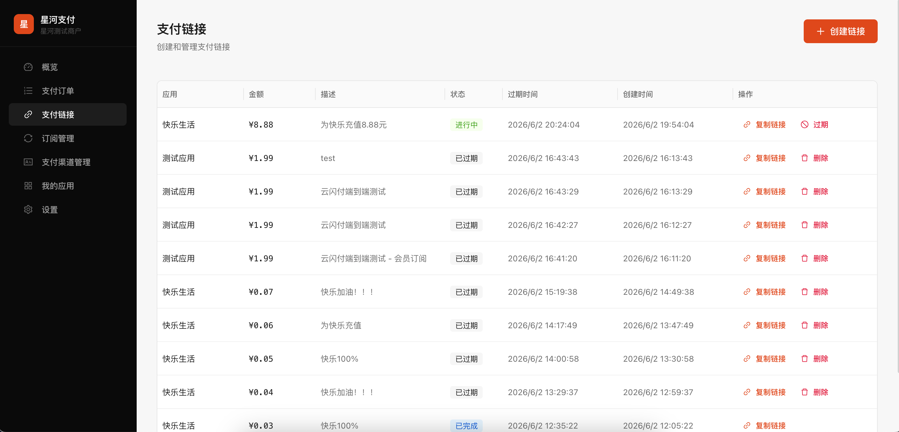

<p align="center">
  <h1 align="center">🌌 星河 · Star-River</h1>
  <p align="center"><strong>AI 时代的支付基础设施</strong></p>
  <p align="center">
- 📖 [文档站点](https://hicooper.github.io/star-river)
    <a href="#-项目结构">项目结构</a> ·
    <a href="#-快速开始">快速开始</a> ·
    <a href="#-贡献指南">贡献指南</a>
  </p>
</p>

---

## 为什么是星河？

国内聚合支付的同质化竞争已经持续了十年 —— 费率差千分之几、渠道覆盖趋同、接入体验在 Stripe 之后也难有突破。**继续在「更好的 API 设计」或「多接一个渠道」上投入，无法建立护城河。**

星河瞄准的是下一代支付范式：**从「工具型 SaaS」进化到「智能型伙伴」。**

| | 传统聚合支付 | 星河 |
|---|---|---|
| **定位** | 支付管道 | 支付 + 增长引擎 |
| **能力** | 统一 API 封装多渠道 | 统一 API + 智能付费墙 + AI 可观测性 |
| **商户感知** | 「我接了一个支付工具」 | 「我有一个帮我想办法增收的支付团队」 |
| **差异化** | 渠道数量竞争 | AI 驱动的付费转化优化 |
| **开源** | 多数闭源 | **完全开源** |

**星河不是「自建 Stripe」，而是探索 Stripe 之后的下一个十年。**

---

## 🧩 项目结构

```
star-river/
├── hydra-pay/          ← 统一支付网关（Go + React）
│   ├── service/           后端：Gin + GORM + PostgreSQL
│   ├── admin/             管理后台 SPA（React + Ant Design）
│   ├── portal/            商户门户 SPA（React）
│   └── pay-frontend/      托管结算页 + 嵌入式 SDK
│
├── hydra-wall/         ← 智能付费墙引擎（Go + Next.js）
│   ├── service/           后端：条件评估引擎 + 事件系统 + 分析
│   ├── front/wall-admin/  管理后台（Next.js 16）
│   └── front/wall-frontend/ 用户侧付费墙渲染
│
└── docs-site/          ← VitePress 文档站点（50+ 篇文档）
```

### 技术栈

| 组件 | 后端 | 前端 | 数据层 |
|------|------|------|--------|
| Hydra-Pay | Go · Gin · GORM | React 18+ · Vite · Ant Design | PostgreSQL 16 |
| Hydra-Wall | Go · Gin · GORM | Next.js 16 · React 19 · Ant Design | PostgreSQL 16 · Redis 7 |

- **可观测性:** OpenTelemetry · Prometheus · 结构化日志
- **弹性:** 限流 + 熔断 · 幂等性保障 · 优雅关闭

### 支付渠道

| 渠道 | 适配器 | 回调处理 | 商户进件 | 测试状态 |
|------|--------|----------|----------|----------|
| 支付宝 | ✅ | ✅ | ✅ 服务商模式 | 🟢 沙箱环境已通过 |
| 微信支付 V3 | ✅ | ✅ | ✅ 服务商模式 | 🟡 未测试（缺商户账号） |
| 云闪付 / 银联 | ✅ | ✅ | — | 🟡 未测试（缺商户账号） |
| 数字人民币 | ✅ | ✅ | — | 🟡 未测试（缺商户账号） |

> **说明：** 所有渠道的适配器代码、回调处理、签名验签逻辑均已完成开发。但由于微信支付、云闪付、数字人民币尚未获得服务商/商户账号资源，目前仅有支付宝沙箱环境完成了端到端验证。欢迎有相关账号资源的贡献者协助测试。

### 业务方接入 SDK

业务方可通过以下方式接入星河支付：

| SDK | 语言/平台 | 用途 | 状态 | 测试状态 |
|-----|-----------|------|------|----------|
| **服务端 SDK（Go）** | Go | 后端集成：创建支付、退款、订阅、Webhook 验证 | ✅ 完成 | 🟢 已测试 |
| **服务端 SDK（JS/TS）** | Node.js / TypeScript | 后端集成：同上，ESM 模块 | ✅ 完成 | 🟢 已测试 |
| **嵌入式结账 SDK** | JavaScript（浏览器） | 前端嵌入：iframe 结账 + postMessage 回调 | ✅ 完成 | 🟢 已测试 |
| **iOS SDK** | Swift | 原生 App 接入付费墙 + 支付 | ❌ 未开始 | — |
| **Android SDK** | Kotlin | 原生 App 接入付费墙 + 支付 | ❌ 未开始 | — |
| **Web SDK** | npm 包 | 前端接入付费墙评估 + 事件上报 | ❌ 未开始 | — |
| **Flutter SDK** | Dart | 跨平台接入付费墙 + 支付 | ❌ 未开始 | — |

> **已完成：** 服务端 SDK（Go + JS/TS）覆盖了 Hydra-Pay 全部 API，后端业务方可直接集成创建支付、退款、订阅管理等能力。嵌入式结账 SDK（`hydra-pay.js`）提供零代码前端接入方案。
>
> **待开发：** 移动端 / 前端原生 SDK（iOS、Android、Web、Flutter）目前仅有 API 文档和接口设计，代码尚未开始。这部分是 Hydra-Wall 付费墙引擎的客户端接入层，属于下一阶段工作。欢迎社区贡献者参与！

---

## 🚀 快速开始

### 环境要求

- **Go** 1.21+
- **Node.js** 20+
- **Docker** & Docker Compose
- **PostgreSQL** 16（或使用 `docker-compose.infra.yml`）

### 1. 克隆仓库

```bash
git clone --recurse-submodules https://github.com/HiCooper/star-river.git
cd star-river
```

### 2. 启动基础设施

```bash
docker compose -f docker-compose.infra.yml up -d
# 启动 PostgreSQL 16 + Redis 7
```

### 3. 启动 Hydra-Pay

```bash
cd hydra-pay/service
cp .env.example .env   # 编辑配置
go run cmd/server/main.go
```

### 4. 启动 Hydra-Wall

```bash
cd hydra-wall/service
cp .env.example .env
go run cmd/server/main.go
```

### 5. 启动前端（可选）

```bash
# 管理后台
cd hydra-pay/admin && npm install && npm run dev

# 商户门户
cd hydra-pay/portal && npm install && npm run dev

# 付费墙管理后台
cd hydra-wall/front/wall-admin && npm install && npm run dev
```

### 6. 启动文档站点

```bash
cd docs-site && npm install && npm run docs:dev
```

访问 `http://localhost:5173` 浏览文档。

---

## 🏗️ 架构概览

```
┌──────────────────────────────────────────────────┐
│                    商户 / 开发者                    │
├──────────┬──────────┬──────────┬─────────────────┤
│  SDK     │  API     │  Portal  │  Hosted Checkout│
└──────────┴──────────┴──────────┴─────────────────┘
                          │
              ┌───────────┴───────────┐
              ▼                       ▼
      ┌──────────────┐       ┌──────────────┐
      │  Hydra-Wall  │◄──────│  Hydra-Pay   │
      │  付费墙引擎   │       │  支付网关     │
      ├──────────────┤       ├──────────────┤
      │ 条件评估引擎  │       │ 渠道适配器    │
      │ 受众定向     │       │ 支付宝·微信   │
      │ A/B 测试     │       │ 云闪付·数币   │
      │ 事件分析     │       │ 订阅·退款     │
      └──────────────┘       └──────────────┘
```

---

## 📸 产品截图

<p align="center">
  
  
</p>

---

## 🗺️ 路线图

### 已完成

- [x] 多渠道支付网关（支付宝沙箱已验证，微信/云闪付/数币适配器已开发）
- [x] 服务端 SDK（Go + JS/TS）+ 嵌入式结账 SDK（hydra-pay.js）
- [x] Stripe 风格托管结算页（桌面/移动端）
- [x] 商户体系（进件、应用管理、API Key）
- [x] 订阅管理（计划、创建、取消）
- [x] 退款 + Webhook HMAC 签名 + 幂等性保障
- [x] 智能付费墙引擎（条件 DSL、受众定向、A/B 配置）
- [x] 付费墙管理后台（Next.js，全功能，已对接真实 API）
- [x] 支付管理后台 + 商户门户
- [x] 限流 + 熔断 + 链路追踪
- [x] 50+ 篇中英文技术文档

### 进行中

- [ ] A/B 测试统计引擎（分流效果评估）
- [ ] 移动端 / 前端客户端 SDK（iOS · Android · Web · Flutter）
- [ ] CI/CD 自动化部署

### 计划中

- [ ] 付费墙可视化模板编辑器
- [ ] 渠道扩展（Stripe / Apple IAP / Google Billing）
- [ ] AI 驱动的定价优化建议
- [ ] 多租户 RBAC 权限体系
- [ ] Grafana 仪表板模板
- [ ] Kubernetes Helm Chart

---

## 🤝 贡献指南

星河采用开放、透明的开发模式，欢迎任何形式的贡献！

### 如何参与

1. **阅读文档** — 从 [产品概述](https://hicooper.github.io/star-river/guide/what-is-hydra) 和 [技术架构](https://hicooper.github.io/star-river/dev/architecture/) 开始
2. **认领 Issue** — 查看仓库中标记为 `good first issue` 的任务
3. **提交 PR** — Fork 仓库，创建功能分支，提交你的改动

### 开发规范

- Go 代码遵循标准项目布局（`cmd/`、`internal/`、`pkg/`）
- 前端使用 ESLint + Prettier，提交前运行 `npm run lint`
- 新增功能请同步更新文档站点
- Commit message 使用 [Conventional Commits](https://www.conventionalcommits.org/) 格式

### 社区

- 📖 [文档站点](https://hicooper.github.io/star-river)
- 💬 [GitHub Discussions](#)
- 🐛 [Issue Tracker](https://github.com/HiCooper/star-river/issues)

---

## 📄 许可证

本项目采用 [Apache License 2.0](LICENSE) 开源。

- ✅ **允许商用** — 可用于商业产品，无需授权费用
- ✅ **允许修改和分发** — 可自由 fork、修改、再发布
- ⚠️ **需保留版权声明** — 分发时必须附带 [LICENSE](LICENSE) 和 [NOTICE](NOTICE) 文件
- ⚠️ **需标注修改** — 修改过的源文件需注明变更
- 🚫 **不得使用本项目商标** — 未经许可不得以「星河支付」「Hydra-Pay」「Hydra-Wall」名义推广衍生品

> **简单说：随便用、随便改、可以商用，但要保留我们的版权声明，告诉大家你基于星河改的。**

---

<p align="center">
  <sub>Built with ❤️ by the Star-River community</sub>
</p>
