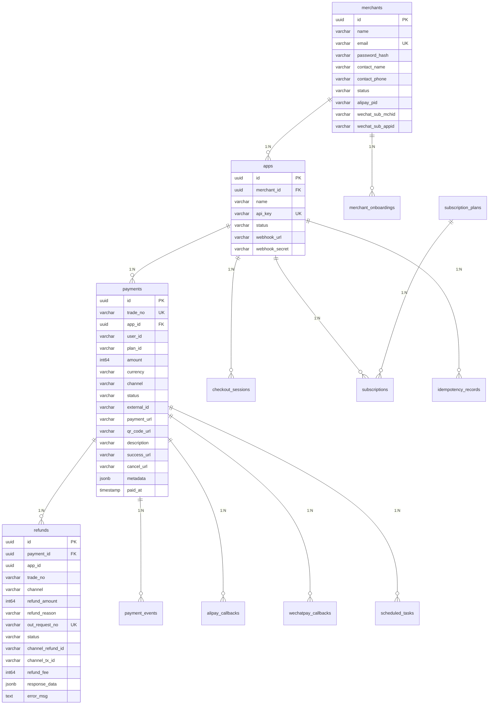

# 数据模型

## 概述

Hydra 使用两个独立的 PostgreSQL 数据库：
- `wall_db` — Hydra-Wall 付费墙数据库
- `hydra_pay` — Hydra-Pay 支付网关数据库

---

## Hydra-Pay 数据模型 (hydra_pay)

共 13 张表，分为核心业务、回调事件、辅助支撑三类。

### 实体关系图



### 1. 核心业务表

#### merchants — 商户主表

| 字段 | 类型 | 约束 | 说明 |
|------|------|------|------|
| id | uuid | PK, default: gen_random_uuid() | |
| name | varchar(255) | NOT NULL | 商户名称 |
| email | varchar(255) | NOT NULL, UNIQUE | 登录邮箱 |
| password_hash | varchar(255) | NOT NULL | bcrypt 加密 |
| contact_name | varchar(100) | | 联系人 |
| contact_phone | varchar(30) | | 联系电话 |
| status | varchar(20) | default: active | active / inactive |
| alipay_pid | varchar(64) | | 支付宝服务商子商户 PID |
| wechat_sub_mchid | varchar(32) | | 微信服务商子商户号 |
| wechat_sub_appid | varchar(32) | | 微信服务商子商户 AppID |
| created_at | timestamp | | |
| updated_at | timestamp | | |

#### apps — 应用表

| 字段 | 类型 | 约束 | 说明 |
|------|------|------|------|
| id | uuid | PK, default: gen_random_uuid() | |
| merchant_id | uuid | NOT NULL, INDEX | → merchants.id |
| name | varchar(255) | NOT NULL | 应用名称 |
| api_key | varchar(255) | NOT NULL, UNIQUE | `sk_` 前缀 + 48 位 hex |
| status | varchar(20) | default: active | |
| webhook_url | varchar(500) | | 支付结果回调地址 |
| webhook_secret | varchar(255) | | HMAC-SHA256 签名密钥 |
| created_at | timestamp | | |
| updated_at | timestamp | | |

#### payments — 支付订单表

| 字段 | 类型 | 约束 | 说明 |
|------|------|------|------|
| id | uuid | PK, default: gen_random_uuid() | |
| trade_no | varchar(32) | NOT NULL, UNIQUE | 22 位商户订单号 |
| app_id | uuid | NOT NULL, INDEX(idx_app_status) | → apps.id |
| user_id | varchar(255) | NOT NULL, INDEX | 用户标识 |
| plan_id | varchar(255) | | 关联订阅计划（弱引用） |
| amount | int64 | NOT NULL | 金额（分） |
| currency | varchar(10) | NOT NULL, default: CNY | |
| channel | varchar(50) | NOT NULL | alipay / wechat / stripe |
| status | varchar(20) | NOT NULL, default: pending, INDEX(idx_app_status) | pending → processing → paid / failed / cancelled / refunded |
| external_id | varchar(255) | INDEX | 渠道交易号 |
| payment_url | varchar(1000) | | H5/JSAPI 支付跳转链接 |
| qr_code_url | varchar(1000) | | Native 支付二维码链接 |
| description | varchar(500) | | 商品描述 |
| success_url | varchar(500) | | 支付成功跳转 |
| cancel_url | varchar(500) | | 取消支付跳转 |
| metadata | jsonb | | 扩展元数据 |
| paid_at | timestamp | | 支付时间 |
| created_at | timestamp | | |
| updated_at | timestamp | | |
| deleted_at | timestamp | INDEX | 软删除 |

**复合索引**: `idx_app_status (app_id, status)` — 商户按状态查订单
**单列索引**: `trade_no (UNIQUE)`, `user_id`, `external_id`, `deleted_at`

#### refunds — 退款记录表

| 字段 | 类型 | 约束 | 说明 |
|------|------|------|------|
| id | uuid | PK, default: gen_random_uuid() | |
| payment_id | uuid | NOT NULL, INDEX | → payments.id |
| app_id | uuid | NOT NULL, INDEX | 冗余，方便按商户查询 |
| trade_no | varchar(32) | INDEX | hydra-pay 交易号 |
| channel | varchar(32) | NOT NULL | alipay / wechat |
| refund_amount | int64 | NOT NULL | 申请退款金额（分） |
| refund_reason | varchar(256) | | 退款原因 |
| out_request_no | varchar(64) | UNIQUE | 退款请求号（幂等） |
| status | varchar(32) | | success / processing / failed |
| channel_refund_id | varchar(64) | | 渠道退款单号 |
| channel_tx_id | varchar(64) | | 渠道原交易号 |
| refund_fee | int64 | NOT NULL, default: 0 | 实际退款金额（分） |
| response_data | jsonb | | 渠道完整响应 |
| error_msg | text | | 失败原因 |
| created_at | timestamp | | |

#### checkout_sessions — 收银台会话表

| 字段 | 类型 | 约束 | 说明 |
|------|------|------|------|
| id | uuid | PK, default: gen_random_uuid() | |
| app_id | uuid | NOT NULL, INDEX | → apps.id |
| user_id | varchar(255) | | 发起用户 |
| amount | int64 | NOT NULL | 金额（分） |
| currency | varchar(10) | NOT NULL, default: CNY | |
| description | varchar(500) | | |
| success_url | varchar(500) | | |
| cancel_url | varchar(500) | | |
| metadata | jsonb | | |
| status | varchar(20) | NOT NULL, default: open, INDEX(idx_session_expires) | open → completed / expired |
| payment_id | uuid | INDEX | 支付完成后回填 → payments.id |
| expires_at | timestamp | INDEX(idx_session_expires) | 过期时间（30 分钟） |
| created_at | timestamp | | |
| updated_at | timestamp | | |

**复合索引**: `idx_session_expires (status, expires_at)` — 定时清理过期会话

#### subscription_plans — 订阅计划表

| 字段 | 类型 | 约束 | 说明 |
|------|------|------|------|
| id | uuid | PK, default: gen_random_uuid() | |
| merchant_id | uuid | NOT NULL, INDEX | → merchants.id，计划按商户隔离 |
| name | varchar(255) | NOT NULL | 计划名称 |
| amount | int64 | NOT NULL | 金额（分） |
| currency | varchar(10) | NOT NULL, default: CNY | |
| interval | varchar(20) | NOT NULL | monthly / yearly / weekly |
| description | varchar(500) | | |
| status | varchar(20) | default: active | active / archived |
| created_at | timestamp | | |
| updated_at | timestamp | | |

#### subscriptions — 用户订阅表

| 字段 | 类型 | 约束 | 说明 |
|------|------|------|------|
| id | uuid | PK, default: gen_random_uuid() | |
| app_id | uuid | NOT NULL, INDEX | → apps.id |
| user_id | varchar(255) | NOT NULL, INDEX | 用户标识 |
| plan_id | varchar(255) | NOT NULL, INDEX | 订阅计划标识（弱引用） |
| status | varchar(20) | default: active, INDEX(idx_sub_period) | active / past_due / cancelled / expired |
| current_period_start | timestamp | NOT NULL | 当前账期开始 |
| current_period_end | timestamp | NOT NULL, INDEX(idx_sub_period) | 当前账期结束 |
| cancelled_at | timestamp | | 取消时间 |
| created_at | timestamp | | |
| updated_at | timestamp | | |

**复合索引**: `idx_sub_period (status, current_period_end)` — 续费提醒

---

### 2. 回调 & 事件表

#### alipay_callbacks — 支付宝异步通知表

| 字段 | 类型 | 约束 | 说明 |
|------|------|------|------|
| id | uuid | PK, default: gen_random_uuid() | |
| payment_id | uuid | NOT NULL, INDEX | → payments.id |
| notify_id | varchar(128) | UNIQUE | 通知 ID（排重） |
| notify_type | varchar(64) | | |
| notify_time | varchar(32) | | |
| sign_type | varchar(16) | | |
| trade_no | varchar(64) | INDEX | 支付宝交易号 |
| out_trade_no | varchar(64) | INDEX | 商户订单号 |
| trade_status | varchar(32) | | TRADE_SUCCESS / WAIT_BUYER_PAY / ... |
| subject | varchar(256) | | |
| total_amount | varchar(16) | | 金额（元，字符串，支付宝原生格式） |
| receipt_amount | varchar(16) | | |
| buyer_pay_amount | varchar(16) | | |
| point_amount | varchar(16) | | |
| invoice_amount | varchar(16) | | |
| buyer_id | varchar(64) | INDEX | |
| buyer_logon_id | varchar(128) | | |
| gmt_create | varchar(32) | | |
| gmt_payment | varchar(32) | | |
| gmt_close | varchar(32) | | |
| fund_bill_list | jsonb | | |
| voucher_detail_list | jsonb | | |
| passback_params | varchar(512) | | |
| raw_body | text | | 原始报文 |
| created_at | timestamp | | |

#### wechatpay_callbacks — 微信支付回调表

| 字段 | 类型 | 约束 | 说明 |
|------|------|------|------|
| id | uuid | PK, default: gen_random_uuid() | |
| payment_id | uuid | NOT NULL, INDEX | → payments.id |
| notification_id | varchar(64) | UNIQUE | 通知 ID（排重） |
| event_type | varchar(64) | | TRANSACTION.SUCCESS |
| transaction_id | varchar(64) | INDEX | 微信支付交易号 |
| out_trade_no | varchar(64) | INDEX | 商户订单号 |
| trade_type | varchar(16) | | JSAPI / NATIVE / APP / MICROPAY |
| trade_state | varchar(32) | | SUCCESS / REFUND / NOTPAY / CLOSED |
| trade_state_desc | varchar(256) | | |
| amount_total | int64 | | 订单金额（分） |
| amount_payer_total | int64 | | 用户支付金额（分） |
| amount_currency | varchar(10) | | |
| amount_payer_currency | varchar(10) | | |
| payer_openid | varchar(64) | INDEX | |
| mchid | varchar(32) | | 商户号 |
| appid | varchar(32) | | |
| attach | varchar(256) | | |
| sp_appid | varchar(32) | | 服务商 AppID |
| sp_mchid | varchar(32) | INDEX | 服务商商户号 |
| sub_appid | varchar(32) | | 子商户 AppID |
| sub_mchid | varchar(32) | INDEX | 子商户号 |
| bank_type | varchar(16) | | |
| success_time | varchar(32) | | |
| promotion_detail | jsonb | | |
| raw_body | text | | 原始报文 |
| created_at | timestamp | | |

#### payment_events — 支付事件表（append-only 审计日志）

| 字段 | 类型 | 约束 | 说明 |
|------|------|------|------|
| id | uuid | PK, default: gen_random_uuid() | |
| payment_id | uuid | NOT NULL, INDEX | → payments.id |
| type | varchar(50) | NOT NULL, INDEX | created / channel_request / callback_received / status_changed / webhook_sent / refund |
| channel | varchar(50) | | |
| raw_body | text | | 原始数据 |
| result | jsonb | | 解析结果 |
| error | text | | 错误信息 |
| created_at | timestamp | | |

---

### 3. 辅助支撑表

#### merchant_onboardings — 商户进件表

| 字段 | 类型 | 约束 | 说明 |
|------|------|------|------|
| id | uuid | PK, default: gen_random_uuid() | |
| merchant_id | uuid | NOT NULL, INDEX | → merchants.id |
| channel | varchar(32) | NOT NULL | alipay / wechat |
| out_request_no | varchar(64) | UNIQUE | 进件请求号（幂等） |
| applyment_id | varchar(64) | INDEX | 渠道申请单号 |
| status | varchar(32) | NOT NULL, default: pending | pending → submitted → auditing → approved / rejected |
| sub_merchant_id | varchar(64) | | 审批通过后的 PID / sub_mchid |
| sign_url | varchar(1000) | | 签约链接 |
| qr_code_url | varchar(1000) | | 签约二维码 |
| request_data | jsonb | | 申请数据 |
| response_data | jsonb | | 渠道返回 |
| callback_data | jsonb | | 回调数据 |
| error_message | text | | 拒绝原因 |
| created_at | timestamp | | |
| updated_at | timestamp | | |

#### idempotency_records — 幂等记录表

| 字段 | 类型 | 约束 | 说明 |
|------|------|------|------|
| id | uuid | PK, default: gen_random_uuid() | |
| idempotency_key | varchar(255) | NOT NULL, UNIQUE(idx_app_idempotency) | 幂等键 |
| app_id | uuid | NOT NULL, UNIQUE(idx_app_idempotency) | → apps.id |
| response_status | int | NOT NULL | 缓存的 HTTP 状态码 |
| response_body | text | NOT NULL | 缓存的响应体 |
| created_at | timestamp | | |
| expires_at | timestamp | NOT NULL, INDEX | 过期时间 |

**联合唯一索引**: `idx_app_idempotency (app_id, idempotency_key)` — 同 app 内幂等 key 唯一

#### scheduled_tasks — 定时任务表

| 字段 | 类型 | 约束 | 说明 |
|------|------|------|------|
| id | uuid | PK, default: gen_random_uuid() | |
| task_type | varchar(64) | NOT NULL, INDEX(idx_task_scheduler) | order_timeout |
| reference_id | uuid | NOT NULL, INDEX | → payments.id |
| execute_at | timestamp | NOT NULL, INDEX(idx_task_scheduler) | 计划执行时间 |
| status | varchar(32) | default: pending, INDEX(idx_task_scheduler) | pending / done / cancelled |
| created_at | timestamp | | |

**复合索引**: `idx_task_scheduler (task_type, status, execute_at)` — 调度器扫表

---

## 索引汇总

| 表 | 索引 | 类型 |
|---|---|---|
| merchants | email | UNIQUE |
| apps | api_key | UNIQUE |
| apps | merchant_id | INDEX |
| payments | trade_no | UNIQUE |
| payments | (app_id, status) | COMPOSITE |
| payments | user_id | INDEX |
| payments | external_id | INDEX |
| payments | deleted_at | INDEX |
| refunds | payment_id | INDEX |
| refunds | app_id | INDEX |
| refunds | trade_no | INDEX |
| refunds | out_request_no | UNIQUE |
| checkout_sessions | app_id | INDEX |
| checkout_sessions | (status, expires_at) | COMPOSITE |
| checkout_sessions | payment_id | INDEX |
| subscription_plans | merchant_id | INDEX |
| subscriptions | app_id | INDEX |
| subscriptions | user_id | INDEX |
| subscriptions | plan_id | INDEX |
| subscriptions | (status, current_period_end) | COMPOSITE |
| alipay_callbacks | payment_id | INDEX |
| alipay_callbacks | notify_id | UNIQUE |
| alipay_callbacks | trade_no | INDEX |
| alipay_callbacks | out_trade_no | INDEX |
| alipay_callbacks | buyer_id | INDEX |
| wechatpay_callbacks | payment_id | INDEX |
| wechatpay_callbacks | notification_id | UNIQUE |
| wechatpay_callbacks | transaction_id | INDEX |
| wechatpay_callbacks | out_trade_no | INDEX |
| wechatpay_callbacks | payer_openid | INDEX |
| wechatpay_callbacks | sp_mchid | INDEX |
| wechatpay_callbacks | sub_mchid | INDEX |
| payment_events | payment_id | INDEX |
| payment_events | type | INDEX |
| merchant_onboardings | merchant_id | INDEX |
| merchant_onboardings | out_request_no | UNIQUE |
| merchant_onboardings | applyment_id | INDEX |
| idempotency_records | (app_id, idempotency_key) | COMPOSITE UNIQUE |
| idempotency_records | expires_at | INDEX |
| scheduled_tasks | (task_type, status, execute_at) | COMPOSITE |
| scheduled_tasks | reference_id | INDEX |

---

## Hydra-Wall 数据模型 (wall_db)

Hydra-Wall 为独立服务，以下为参考模型。

### apps 应用表

```sql
CREATE TABLE apps (
    id VARCHAR(32) PRIMARY KEY,
    name VARCHAR(255) NOT NULL,
    platform VARCHAR(32) NOT NULL,
    api_key VARCHAR(128) UNIQUE NOT NULL,
    secret_key VARCHAR(128) NOT NULL,
    status VARCHAR(32) DEFAULT 'active',
    config JSONB DEFAULT '{}',
    created_at TIMESTAMP DEFAULT CURRENT_TIMESTAMP,
    updated_at TIMESTAMP DEFAULT CURRENT_TIMESTAMP
);
```

### plans 商品计划表

```sql
CREATE TABLE plans (
    id VARCHAR(32) PRIMARY KEY,
    app_id VARCHAR(32) NOT NULL REFERENCES apps(id),
    name VARCHAR(255) NOT NULL,
    description TEXT,
    price INT NOT NULL,
    currency VARCHAR(3) DEFAULT 'CNY',
    interval VARCHAR(32) NOT NULL,
    trial_days INT DEFAULT 0,
    product_id VARCHAR(64),
    features JSONB DEFAULT '[]',
    sort_order INT DEFAULT 0,
    status VARCHAR(32) DEFAULT 'active',
    created_at TIMESTAMP DEFAULT CURRENT_TIMESTAMP,
    updated_at TIMESTAMP DEFAULT CURRENT_TIMESTAMP
);
```

### entitlements 用户权限表

```sql
CREATE TABLE entitlements (
    id VARCHAR(32) PRIMARY KEY,
    user_id VARCHAR(64) NOT NULL,
    app_id VARCHAR(32) NOT NULL REFERENCES apps(id),
    plan_id VARCHAR(32) NOT NULL REFERENCES plans(id),
    status VARCHAR(32) NOT NULL,
    trial_end TIMESTAMP,
    expires_at TIMESTAMP,
    auto_renew BOOLEAN DEFAULT true,
    cancelled_at TIMESTAMP,
    created_at TIMESTAMP DEFAULT CURRENT_TIMESTAMP,
    updated_at TIMESTAMP DEFAULT CURRENT_TIMESTAMP,
    UNIQUE(user_id, app_id, plan_id)
);
```

### paywall_configs 付费墙配置表

```sql
CREATE TABLE paywall_configs (
    id VARCHAR(32) PRIMARY KEY,
    app_id VARCHAR(32) NOT NULL REFERENCES apps(id),
    name VARCHAR(255) NOT NULL,
    template VARCHAR(32) DEFAULT 'standard',
    layout JSONB DEFAULT '{}',
    theme JSONB DEFAULT '{}',
    rules JSONB DEFAULT '[]',
    status VARCHAR(32) DEFAULT 'active',
    created_at TIMESTAMP DEFAULT CURRENT_TIMESTAMP,
    updated_at TIMESTAMP DEFAULT CURRENT_TIMESTAMP
);
```

### experiments 实验表

```sql
CREATE TABLE experiments (
    id VARCHAR(32) PRIMARY KEY,
    app_id VARCHAR(32) NOT NULL REFERENCES apps(id),
    name VARCHAR(255) NOT NULL,
    description TEXT,
    status VARCHAR(32) DEFAULT 'draft',
    variants JSONB NOT NULL,
    metrics JSONB NOT NULL,
    targeting JSONB DEFAULT '[]',
    start_at TIMESTAMP,
    end_at TIMESTAMP,
    created_at TIMESTAMP DEFAULT CURRENT_TIMESTAMP,
    updated_at TIMESTAMP DEFAULT CURRENT_TIMESTAMP
);
```

---

## 下一步

- [Hydra-Pay 服务架构](/dev/pay/service-architecture)
- [回调处理流程](/dev/pay/callback-flow)
- [商户进件](/dev/pay/merchant-onboarding)
- [Webhook 签名验证](/dev/integration/webhook-verification)
