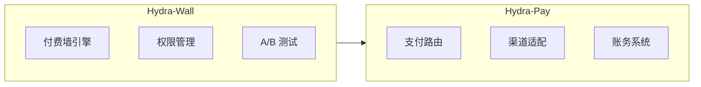
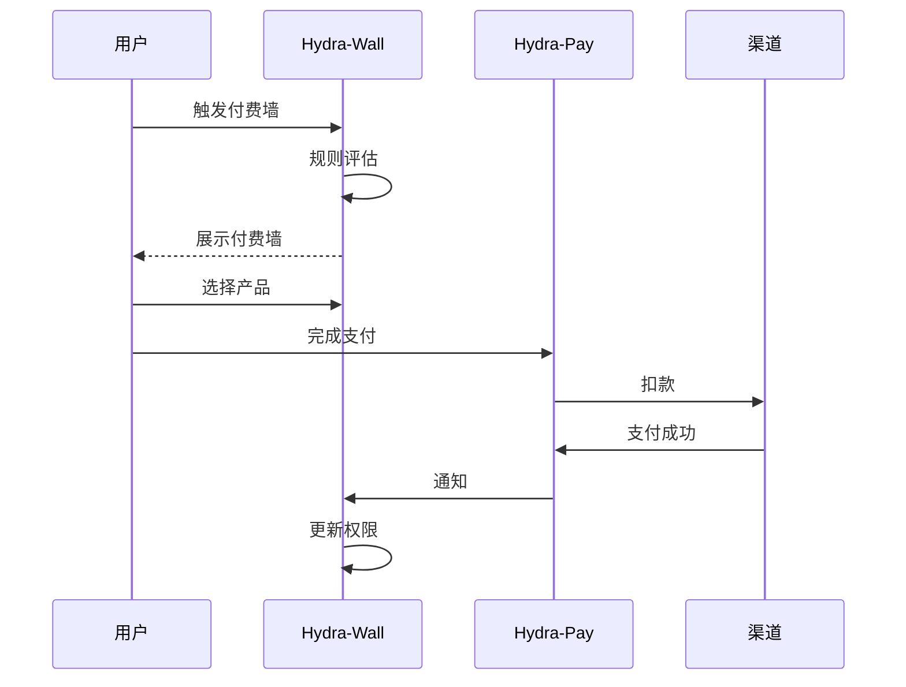

# Hydra 架构总览

Hydra 支付基础设施由两个核心服务组成：**Hydra-Wall**（付费墙）和 **Hydra-Pay**（支付网关）。

## 服务概览

| 服务 | 端口 | 数据库 | 主要功能 |
|------|------|--------|----------|
| Hydra-Wall | 8080 | wall_db | 付费墙引擎 / 权限管理 / A/B测试 |
| Hydra-Pay | 8081 | pay_db | 支付路由 / 渠道适配 / 账务系统 |

## 客户端 SDK 支持

| SDK | iOS | Android | Web | Flutter |
|-----|-----|---------|-----|---------|
| **Hydra-Wall** | Swift | Kotlin | TypeScript | Dart |
| **Hydra-Pay** | Swift | Kotlin | TypeScript | Dart |

## 接入模式

### Hydra-Wall 接入模式

| 模式 | 说明 |
|------|------|
| Full Hosted | 一行代码跳转，无需自建 UI |
| Embedded SDK | 组件嵌入，灵活定制 |

### Hydra-Pay 接入模式

| 模式 | 说明 |
|------|------|
| Full Hosted | 一行代码跳转托管结算页 |
| Embedded SDK | 支付表单 iframe 嵌入 |
| API Only | 纯 API，接入方自建 UI |

## 核心流程

### 付费流程

### 支付渠道

| 渠道 | 类型 | 地区 |
|------|------|------|
| 支付宝 | 跳转类 | 中国 |
| 微信支付 | 跳转类 | 中国 |
| Stripe | API 类 | 海外 |
| Apple IAP | 应用内购买 | 全球 |
| Google Billing | 应用内购买 | 全球 |

## 熔断降级策略

| 条件 | Primary | Fallback 1 | Fallback 2 |
|------|---------|------------|------------|
| 中国区 | Alipay | WeChat Pay | Stripe |
| 海外区 | Stripe | Alipay | - |
| Apple 设备订阅 | Apple IAP | Stripe | - |

## 详细架构

详细架构设计请参考：
- [系统架构](./system) - 系统整体架构图
- [核心时序图](./sequence) - 核心交互时序图
- [Hydra-Wall 架构](../wall/service-architecture) - Wall 服务详细架构
- [Hydra-Pay 架构](../pay/service-architecture) - Pay 服务详细架构
