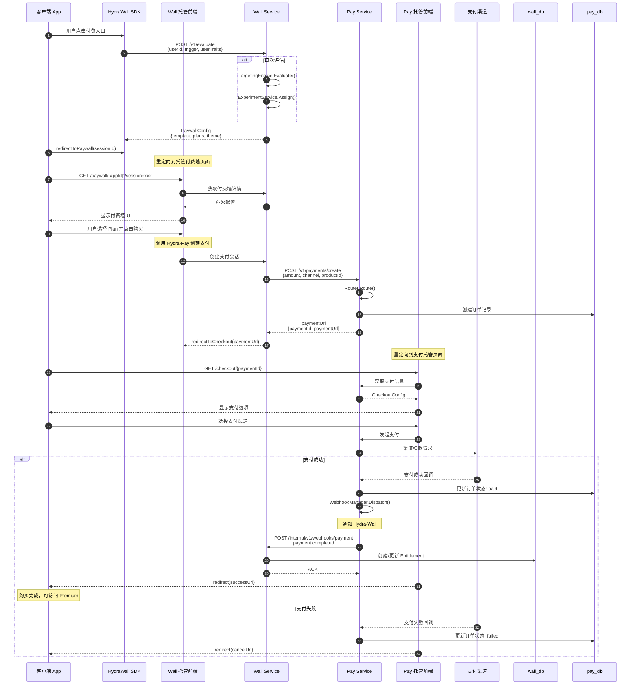
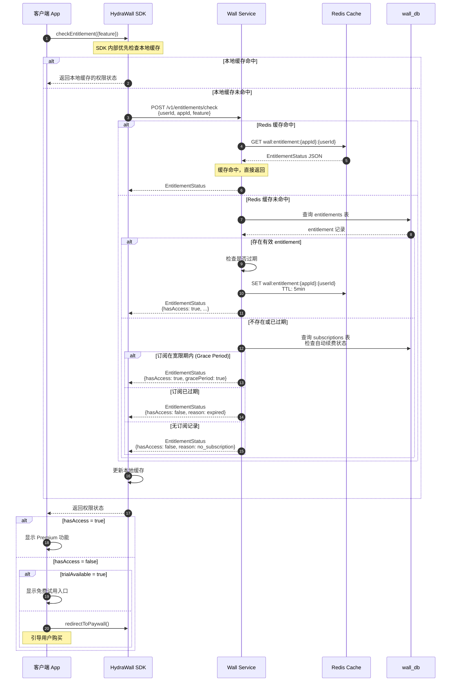
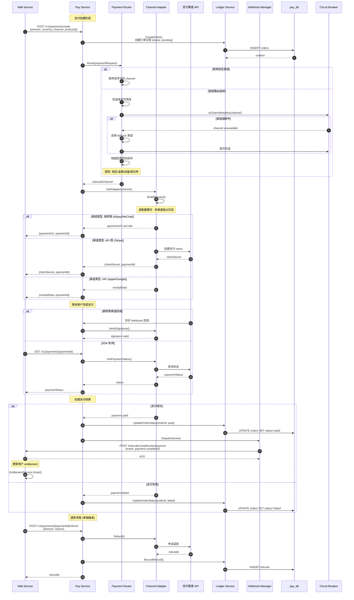
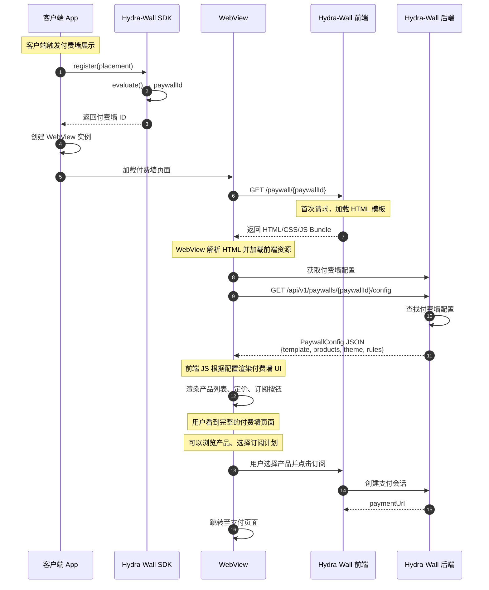
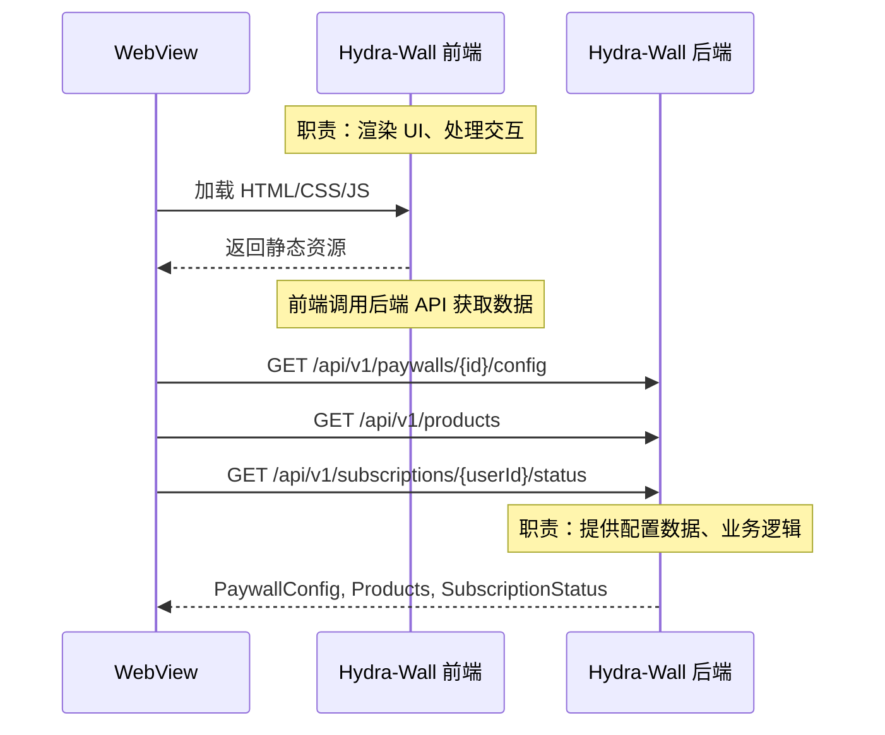
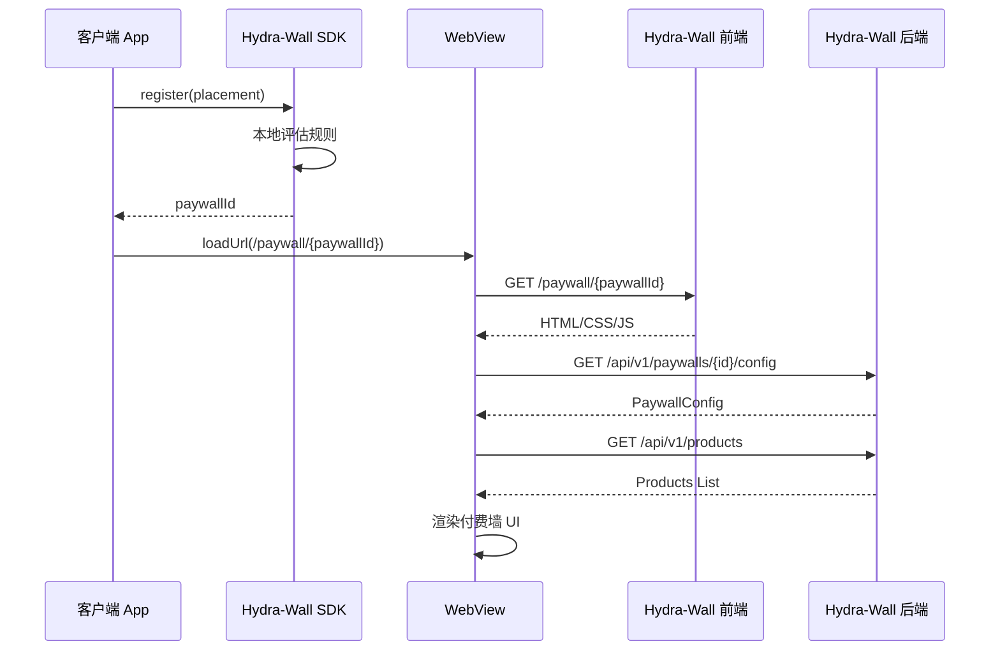

# Hydra 核心交互时序图

本文档包含 Hydra 支付基础设施的核心交互时序图，包含购买流程、权限检查、支付回调和 WebView 渲染架构。

## 目录

- [流程一：完整购买流程](#流程一完整购买流程)
- [流程二：权限检查流程](#流程二权限检查流程)
- [流程三：支付路由与渠道回调](#流程三支付路由与渠道回调)
- [流程四：客户端付费墙加载流程（WebView 渲染）](#流程四客户端付费墙加载流程webview-渲染)
- [Hydra-Wall 核心架构](#hydra-wall-核心架构)


## 流程一：完整购买流程

**描述**：从用户点击付费入口到购买完成的完整时序



### 流程概览

<div class="flow-summary">
  <div class="flow-card">
    <div class="flow-card-header">
      <div class="flow-number">1</div>
      <span>完整购买流程</span>
    </div>
    <div class="flow-card-body">
      <div class="flow-step">Client -> WallSDK (触发评估)</div>
      <div class="flow-step">-> Wall Service (规则匹配)</div>
      <div class="flow-step">-> Pay Service (创建支付)</div>
      <div class="flow-step">-> Channel (渠道扣款)</div>
      <div class="flow-step">-> Webhook (回调通知)</div>
      <div class="flow-step">-> Entitlement (更新权限)</div>
    </div>
  </div>
</div>

---

## 流程二：权限检查流程

**描述**：客户端检查用户是否有权限访问 Premium 功能



### 流程概览

<div class="flow-summary">
  <div class="flow-card">
    <div class="flow-card-header">
      <div class="flow-number">2</div>
      <span>权限检查流程</span>
    </div>
    <div class="flow-card-body">
      <div class="flow-step">Client -> SDK (发起检查)</div>
      <div class="flow-step">-> Redis Cache (缓存查询)</div>
      <div class="flow-step">-> DB (未命中时)</div>
      <div class="flow-step">-> 返回权限状态</div>
    </div>
  </div>
</div>

---

## 流程三：支付路由与渠道回调

**描述**：Hydra-Pay 如何选择支付渠道并处理异步回调



### 流程概览

<div class="flow-summary">
  <div class="flow-card">
    <div class="flow-card-header">
      <div class="flow-number">3</div>
      <span>支付路由与回调</span>
    </div>
    <div class="flow-card-body">
      <div class="flow-step">Router (智能路由)</div>
      <div class="flow-step">-> Adapter (渠道适配)</div>
      <div class="flow-step">-> Channel API (渠道扣款)</div>
      <div class="flow-step">-> Ledger (记账)</div>
    </div>
  </div>
</div>

<style>
.flow-summary {
  display: grid;
  grid-template-columns: repeat(3, 1fr);
  gap: 16px;
  margin-top: 32px;
}

.flow-card {
  border: 1px solid #cbd5e1;
  padding: 16px;
}

.flow-card-header {
  font-size: 12px;
  font-weight: 600;
  margin-bottom: 8px;
  display: flex;
  align-items: center;
  gap: 8px;
}

.flow-number {
  background: #0f172a;
  color: white;
  width: 20px;
  height: 20px;
  display: flex;
  align-items: center;
  justify-content: center;
  font-size: 11px;
}

.flow-card-body {
  font-size: 11px;
  color: #64748b;
}

.flow-step {
  display: flex;
  align-items: center;
  gap: 8px;
  padding: 4px 0;
}
</style>

---

## 流程四：客户端付费墙加载流程（WebView 渲染）

**描述**：客户端 App 通过 WebView 加载 Hydra-Wall 托管的付费墙页面，前端调用后端 API 获取配置数据进行渲染



### WebView 渲染的优势

| 优势 | 说明 |
|------|------|
| **跨平台一致** | 同一 HTML/CSS 在 iOS/Android/Web 渲染完全一致 |
| **热更新** | 付费墙样式和逻辑可随时修改，无需 App 更新 |
| **快速迭代** | 运营人员可通过后台修改付费墙配置 |
| **CDN 加速** | 前端资源从 CDN 加载，全球快速访问 |

### 前端与后端分工



| 组件 | 职责 |
|------|------|
| **前端 (Static Resources)** | HTML/CSS/JS Bundle，提供 UI 渲染和用户交互 |
| **后端 (API Service)** | 提供付费墙配置、产品数据、用户订阅状态 |

---

## Hydra-Wall 核心架构

### 系统架构图

```
客户端 App
    │
    ├── iOS SDK
    ├── Android SDK
    └── Web SDK
            │
            ▼
┌─────────────────────────────────────────────────────────┐
│                    Hydra-Wall SDK                       │
│  • 本地缓存 Campaign 配置                               │
│  • 设备端规则评估                                        │
│  • 调用后端 API 获取付费墙配置                           │
└─────────────────────────────────────────────────────────┘
            │
            ▼
┌─────────────────────────────────────────────────────────┐
│               Hydra-Wall 前端 (静态资源)                │
│  • HTML/CSS/JS Bundle                                   │
│  • 调用后端 API 获取产品、定价、主题                     │
│  • CDN 加速全球访问                                      │
└─────────────────────────────────────────────────────────┘
            │
            ▼
┌─────────────────────────────────────────────────────────┐
│               Hydra-Wall 后端服务                       │
│  • PaywallConfig API                                    │
│  • 产品、定价、主题配置                                  │
│  • Entitlement 管理                                      │
│  • Targeting Engine                                     │
│  • Experiment Service                                   │
└─────────────────────────────────────────────────────────┘
            │
            ▼
┌─────────────────────────────────────────────────────────┐
│               数据存储层                                 │
│  • wall_db (PostgreSQL) - 付费墙配置、用户权限          │
│  • Redis Cache - 配置缓存加速                           │
└─────────────────────────────────────────────────────────┘
```

### 渲染流程时序




