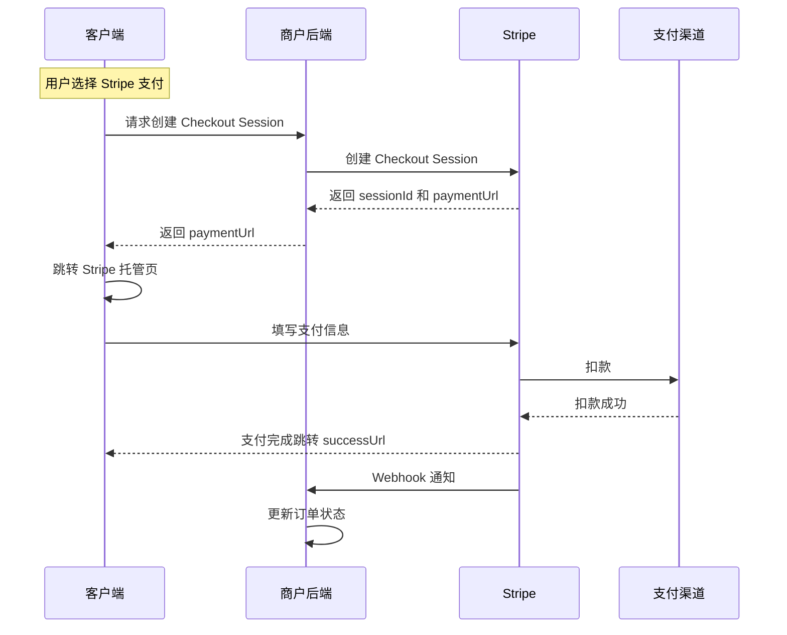
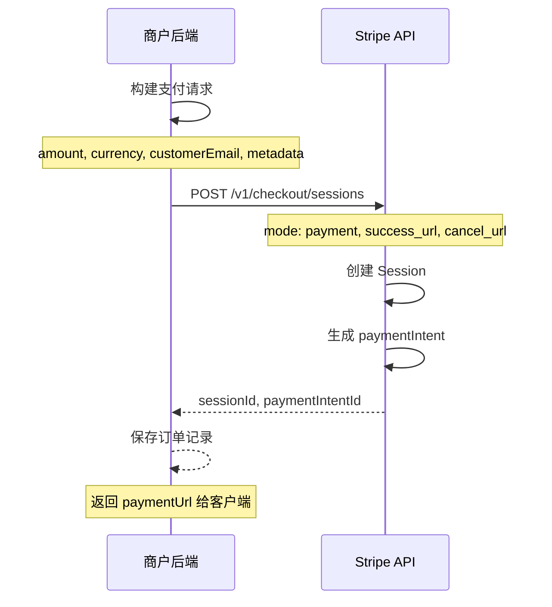
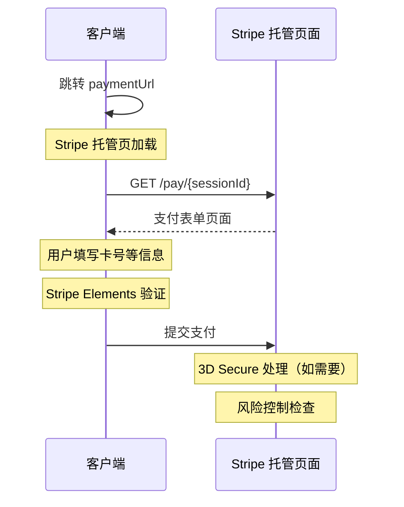
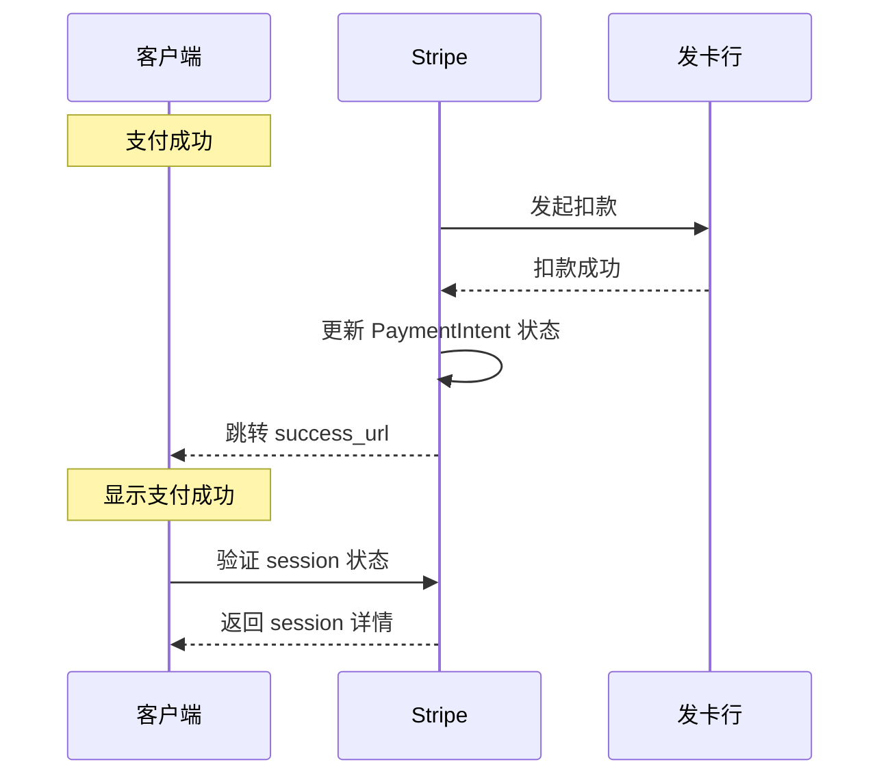
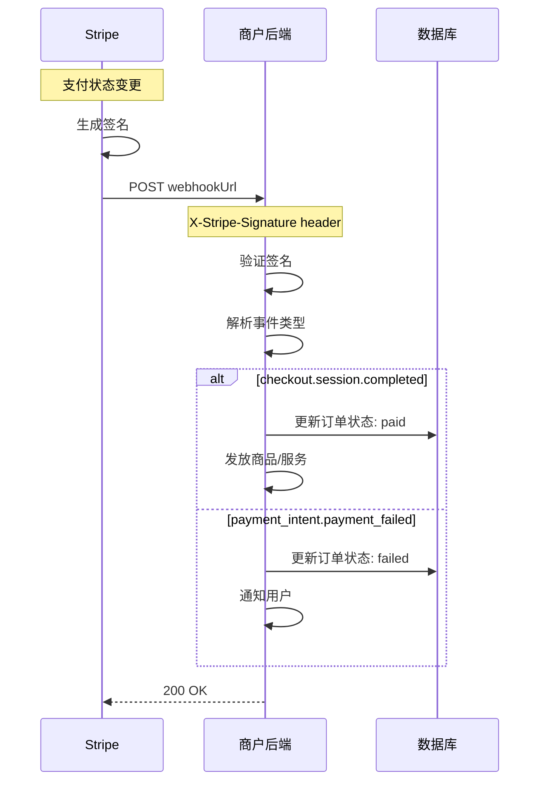

# Stripe 支付服务工作流程

本文档描述 Stripe 支付的完整工作流程，作为 Hydra-Pay 架构设计的参考。

## 目录

- [支付流程概览](#支付流程概览)
- [Checkout Session 创建](#checkout-session-创建)
- [支付页面渲染](#支付页面渲染)
- [支付完成处理](#支付完成处理)
- [Webhook 通知](#webhook-通知)
- [参考架构对比](#参考架构对比)

---

## 支付流程概览



---

## Checkout Session 创建

**描述**：商户后端调用 Stripe API 创建支付会话



### Checkout Session 配置参数

| 参数 | 说明 |
|------|------|
| mode | payment / subscription |
| amount | 金额（分） |
| currency | 币种（usd, cny） |
| customer_email | 客户邮箱 |
| line_items | 商品列表 |
| success_url | 支付成功跳转地址 |
| cancel_url | 支付取消跳转地址 |
| metadata | 商户自定义数据 |

---

## 支付页面渲染

**描述**：用户被重定向到 Stripe 托管的支付页面



### Stripe 托管页面特点

| 特性 | 说明 |
|------|------|
| 托管页面 | Stripe 提供安全的支付页面 |
| PCI 合规 | 无需商户处理敏感卡信息 |
| 多语言支持 | 自动适配用户地区 |
| 移动端优化 | 响应式设计 |

---

## 支付完成处理

**描述**：支付完成后 Stripe 处理结果并跳转



---

## Webhook 通知

**描述**：Stripe 通过 Webhook 异步通知商户支付结果



### Webhook 事件类型

| 事件 | 触发时机 |
|------|----------|
| checkout.session.completed | Checkout Session 完成 |
| payment_intent.succeeded | 支付成功 |
| payment_intent.payment_failed | 支付失败 |
| charge.refunded | 退款处理 |
| customer.subscription.created | 订阅创建 |
| customer.subscription.updated | 订阅更新 |
| customer.subscription.deleted | 订阅取消 |

### 签名验证

```python
def verify_stripe_signature(payload, signature, secret):
    # 使用 Stripe Webhook Secret 验证签名
    event = stripe.Webhook.construct_event(
        payload, signature, secret
    )
    return event
```

---

## Stripe 与 Hydra-Pay 架构对比

| 维度 | Stripe | Hydra-Pay |
|------|--------|-----------|
| **支付模式** | Checkout Session / Payment Intent | 类似设计 |
| **托管页面** | Stripe 提供托管页 | Hydra 提供托管页 |
| **API 风格** | RESTful + Webhook | RESTful + Webhook |
| **签名验证** | HMAC SHA256 | HMAC SHA256 |
| **渠道集成** | Stripe 自有渠道 | 多渠道适配器模式 |
| **商户 Dashboard** | Stripe Dashboard | Hydra Console |
| **Webhook 重试** | 自动重试，最长 72 小时 | 自动重试机制 |

---

## 参考资料

- [Stripe Checkout Documentation](https://stripe.com/docs/payments/checkout)
- [Stripe Webhooks](https://stripe.com/docs/webhooks)
- [Stripe Payment Intents](https://stripe.com/docs/payments/payment-intents)
- [Stripe SDK](https://stripe.com/docs/sdks)
