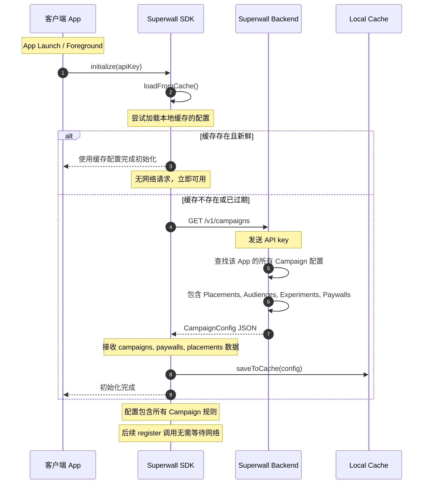
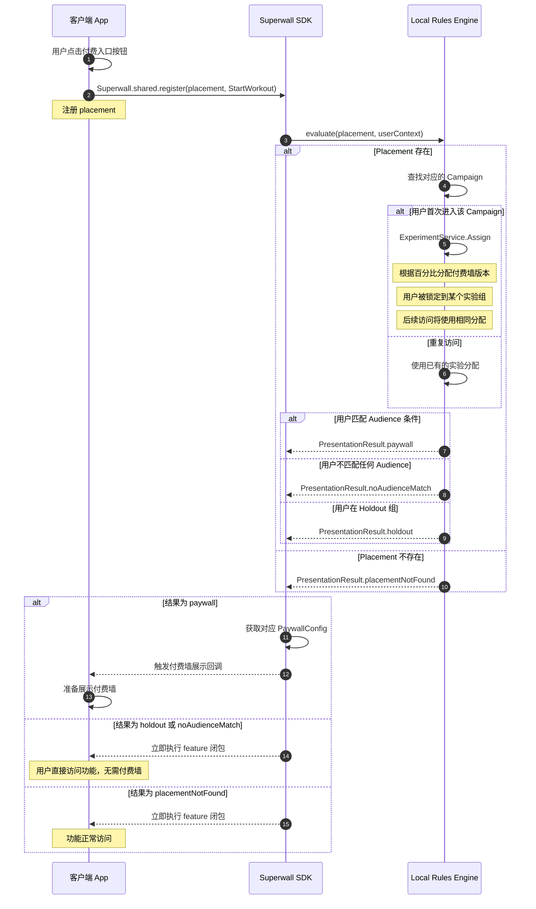
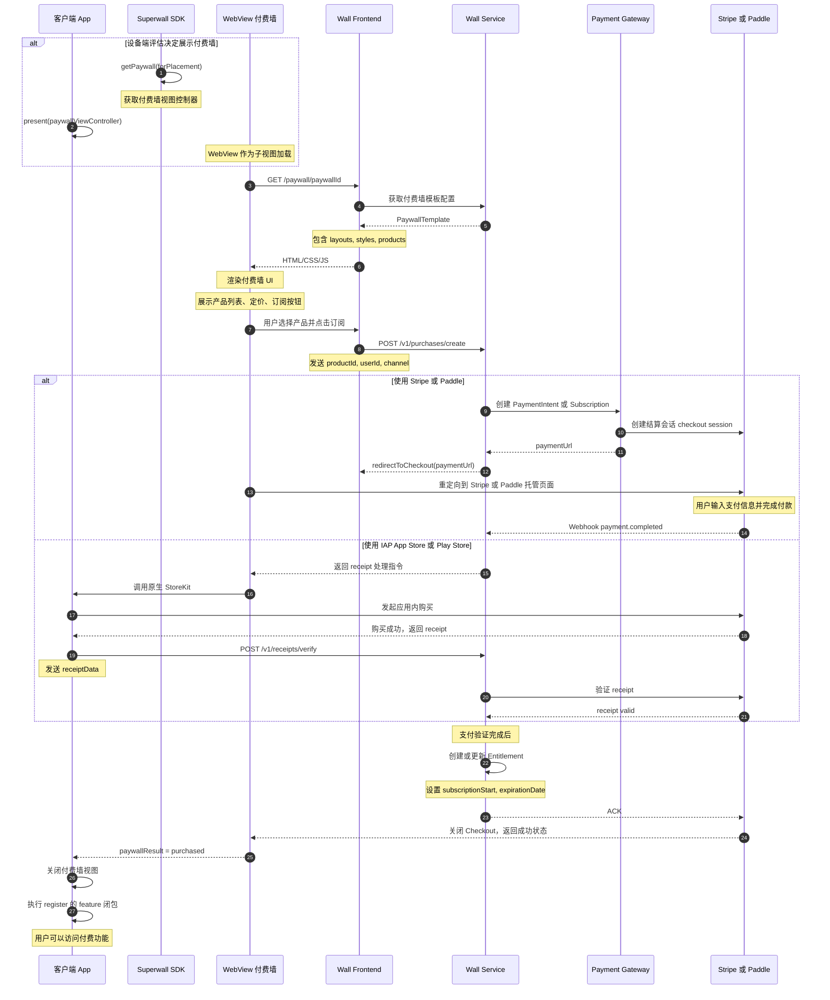
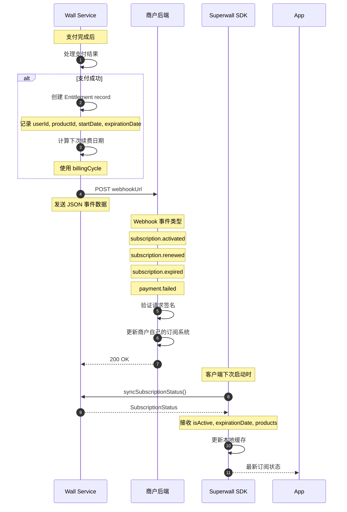
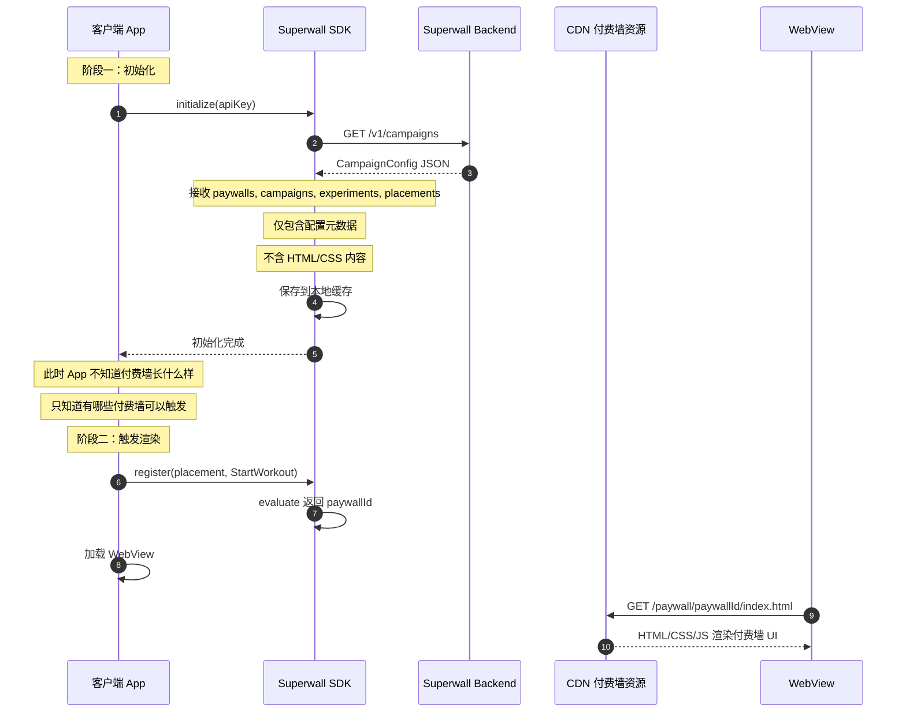

# Superwall 付费墙渲染流程

本文档为同行业参考，描述 Superwall 付费墙从触发到渲染的完整流程，作为 Hydra-Wall 架构设计的对比参考。

## 目录

- [流程一：SDK 初始化与配置拉取](#流程一sdk-初始化与配置拉取)
- [流程二：Placement 触发与规则评估](#流程二placement-触发与规则评估)
- [流程三：付费墙渲染与购买流程](#流程三付费墙渲染与购买流程)
- [流程四：Webhook 通知与权限更新](#流程四webhook-通知与权限更新)

---

## 流程一：SDK 初始化与配置拉取

**描述**：App 启动时，Superwall SDK 从服务端拉取 Campaign 配置并缓存在本地



### 设计要点

| 特性 | 说明 |
|------|------|
| **本地优先** | SDK 优先使用缓存配置，register 调用无网络延迟 |
| **增量更新** | 只会拉取自上次同步后变更的配置 |
| **离线可用** | 缓存过期后，若无网络，SDK 会使用过期配置并重试 |

---

## 流程二：Placement 触发与规则评估

**描述**：当用户触发某个 Placement 时，SDK 在设备端完成规则评估，无需网络请求



### 设备端规则评估的优势

| 优势 | 说明 |
|------|------|
| **零延迟** | 无需等待网络响应，付费墙可即时展示 |
| **离线可用** | 网络中断时仍能正常触发付费墙 |
| **减轻服务端压力** | 规则评估在客户端完成，减少服务端 QPS |
| **隐私合规** | 用户数据无需上传用于规则评估 |

---

## 流程三：付费墙渲染与购买流程

**描述**：付费墙通过 WebView 渲染，购买流程由 Superwall 服务端处理



### WebView 渲染的优势

| 优势 | 说明 |
|------|------|
| **跨平台一致** | 同一 HTML/CSS 在 iOS/Android/Web 渲染完全一致 |
| **热更新** | 付费墙样式和逻辑可随时修改，无需 App 更新 |
| **向后兼容** | 浏览器内核保证旧内容持续可渲染 |
| **迭代速度** | 运营人员可通过可视化编辑器修改付费墙 |

---

## 流程四：Webhook 通知与权限更新

**描述**：支付完成后，Superwall 通过 Webhook 通知商户后端系统



### Webhook 事件类型

| 事件 | 触发时机 |
|------|----------|
| subscription.activated | 用户首次订阅成功 |
| subscription.renewed | 订阅自动续费成功 |
| subscription.expired | 订阅过期或被取消 |
| payment.failed | 续费扣款失败 |
| payment.refunded | 退款处理完成 |
| trial.started | 用户开始免费试用 |
| trial.converted | 试用转正式订阅 |
| trial.not_converted | 试用结束，用户未订阅 |

---

## Superwall vs Hydra-Wall 对比

| 维度 | Superwall | Hydra-Wall |
|------|-----------|------------|
| **渲染引擎** | WebView 跨平台一致 | 未明确，预计类似 |
| **规则评估** | 设备端评估，无延迟 | 服务端评估，每次请求 |
| **配置缓存** | SDK 本地缓存加后台同步 | 服务端管理 |
| **付费墙托管** | Superwall 托管 | Hydra 托管 |
| **支付处理** | Stripe/Paddle/IAP | 跳转至渠道 |
| **Webhook 通知** | 支持多事件类型 | 支持支付回调 |
| **离线支持** | 部分功能可用 | 依赖网络 |

---

## 参考资料

- [Why We Chose Web Views - Superwall](https://superwall.com/blog/why-we-chose-web-views-the-strategic-advantage-behind-superwalls)
- [Presenting Paywalls - Superwall Docs](https://superwall.com/docs/ios/quickstart/feature-gating)
- [Web Paywalls - Superwall](https://superwall.com/features/web-paywalls)
- [Superwall Android SDK](https://github.com/superwall/Superwall-Android)

---

## SDK 初始化细节：配置 vs 渲染数据

### 两个阶段的数据分离

Superwall SDK 初始化阶段**只拉取配置，不包含渲染数据**。



### 初始化拉取的内容（轻量配置）

```json
{
  "campaigns": [
    {
      "id": "camp_123",
      "name": "Premium Upgrade",
      "status": "active",
      "placements": ["StartWorkout", "ExportData"]
    }
  ],
  "paywalls": [
    {
      "id": "pw_premium_v1",
      "name": "Premium Paywall",
      "campaignId": "camp_123",
      "products": ["prod_monthly", "prod_yearly"]
    }
  ],
  "experiments": [
    {
      "id": "exp_456",
      "paywallIds": ["pw_premium_v1", "pw_premium_v2"],
      "distribution": {"pw_premium_v1": 50, "pw_premium_v2": 50}
    }
  ]
}
```

### 渲染时才加载的内容（重量资源）

| 资源 | 大小 | 说明 |
|------|------|------|
| HTML 模板 | 50-200KB | 付费墙布局结构 |
| CSS 样式 | 30-100KB | 主题、颜色、字体 |
| JS 逻辑 | 20-80KB | 交互逻辑、产品展示 |
| 产品图片 | 按需加载 | CDN 托管 |
| **总计** | **100-400KB** | 首次渲染需要下载 |

### 离线行为

| 场景 | 配置可用 | 付费墙可渲染 |
|------|---------|-------------|
| 缓存新鲜 | 是 | 是，已缓存 |
| 缓存过期，无网络 | 是，用过期配置 | 否，新付费墙无法加载 |
| 首次安装，无网络 | 否 | 否 |

### 设计优势

| 优势 | 说明 |
|------|------|
| **初始化快** | 只需下载轻量 JSON，小于 50KB，无需等待完整页面资源 |
| **流量省** | 用户可能触发多个付费墙，但只有看到的才下载渲染资源 |
| **离线支持** | 配置可缓存，触发规则在离线时仍然有效 |
| **CDN 加速** | 渲染资源从 CDN 加载，全球快速访问 |

### 设计权衡

| 权衡 | 影响 |
|------|------|
| **首次渲染延迟** | 首次触发付费墙时需要下载资源，有网络延迟 |
| **预加载策略** | Superwall 会在后台预加载用户最可能看到的付费墙 |
| **更新时机** | 付费墙内容更新后，已缓存的用户可能看到旧版本直到刷新 |
