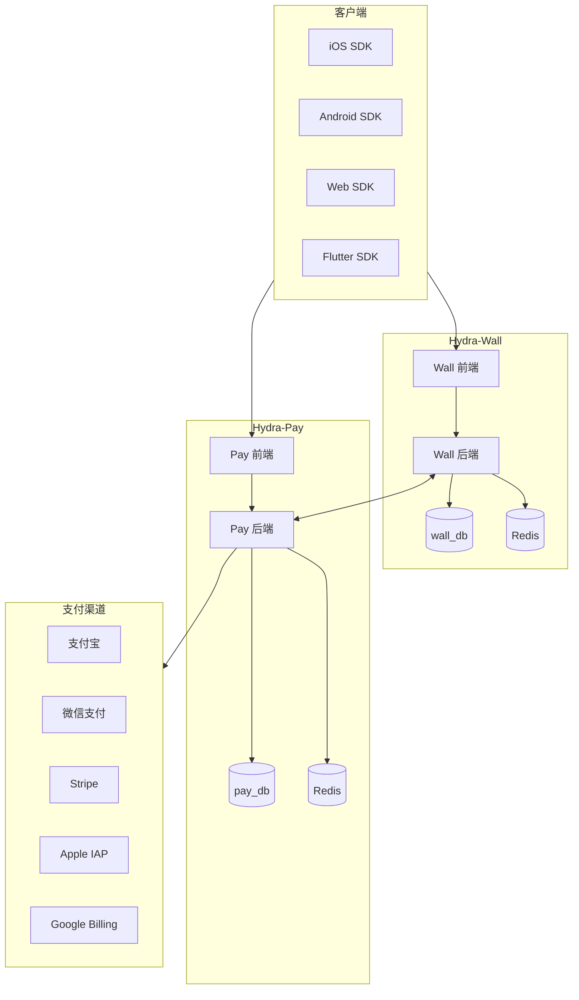
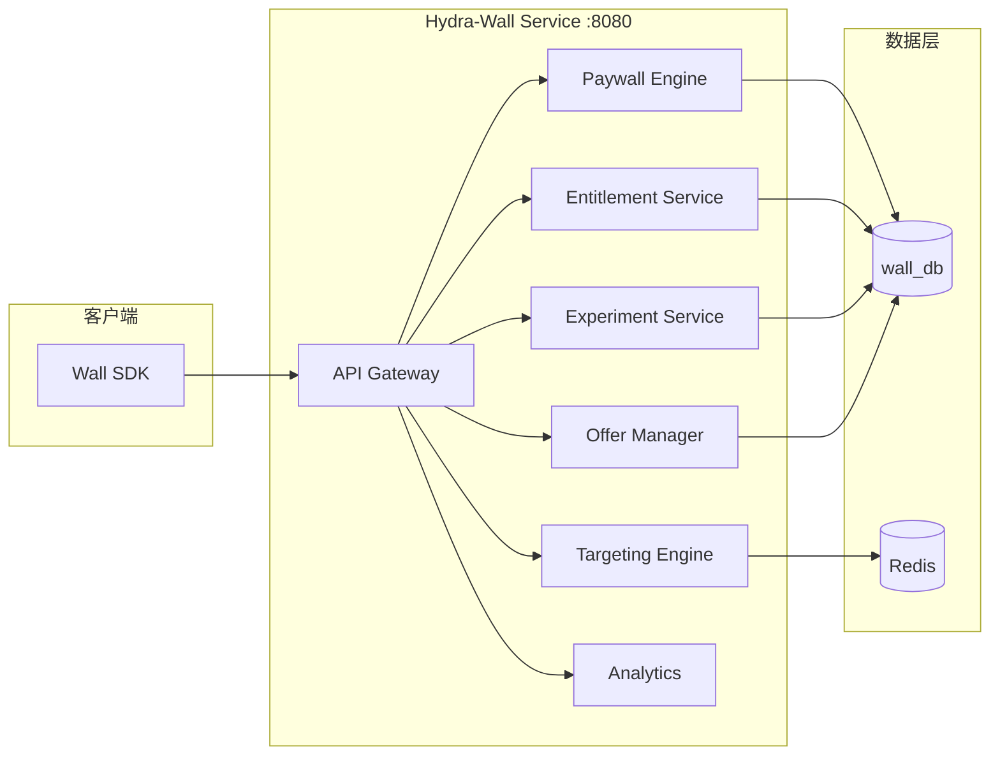
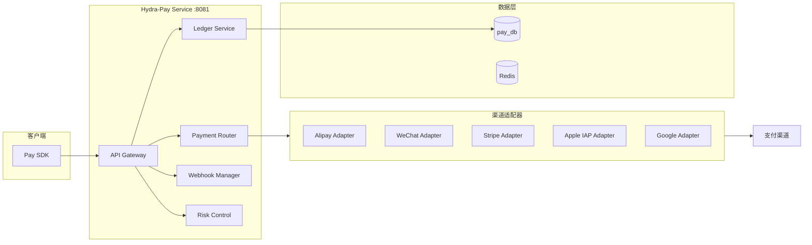
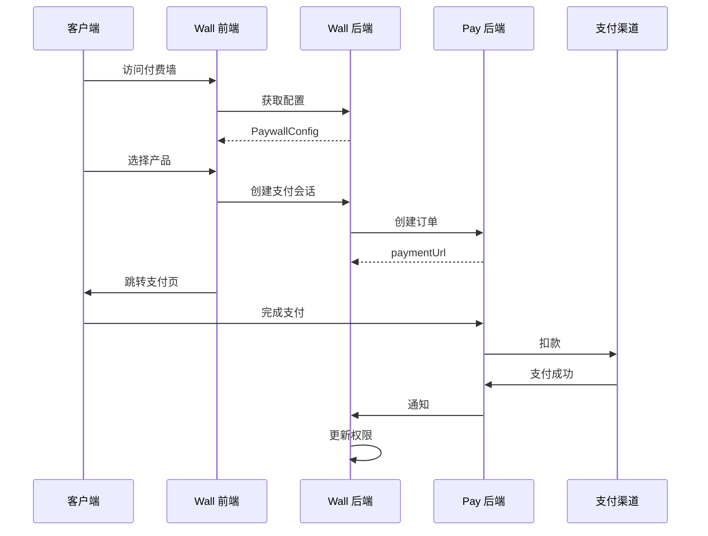

# Hydra 系统架构

本文档描述 Hydra 支付基础设施的整体系统架构。

## 架构总览

## Hydra-Wall 架构

### 核心模块

| 模块 | 职责 |
|------|------|
| Paywall Engine | 规则匹配、展示决策、模板渲染 |
| Entitlement Service | 订阅状态、权限判定、试用管理 |
| Targeting Engine | 行为触发、用户分群、条件规则 |
| Experiment Service | A/B 测试、分组分配、统计计算 |
| Offer Manager | Plans、Offers、促销规则 |
| Analytics | 收入分析、漏斗追踪、实时监控 |

## Hydra-Pay 架构

### 核心模块

| 模块 | 职责 |
|------|------|
| Payment Router | 智能路由、失败重试、熔断降级 |
| Ledger Service | 订单管理、交易流水、对账清算 |
| Webhook Manager | 回调处理、事件投递、重试机制 |
| Risk Control | 风控规则、反欺诈、限流 |

## 服务通信

## SDK 支持

| 平台 | SDK | 语言 |
|------|-----|------|
| iOS | Hydra-Wall / Hydra-Pay | Swift |
| Android | Hydra-Wall / Hydra-Pay | Kotlin |
| Web | Hydra-Wall / Hydra-Pay | TypeScript |
| Flutter | Hydra-Wall / Hydra-Pay | Dart |

## 支付渠道

| 渠道 | 类型 | 适用场景 |
|------|------|----------|
| 支付宝 | 跳转类 | 中国区 |
| 微信支付 | 跳转类 | 中国区 |
| Stripe | API 类 | 海外 |
| Apple IAP | 应用内购买 | iOS 订阅 |
| Google Billing | 应用内购买 | Android 订阅 |
