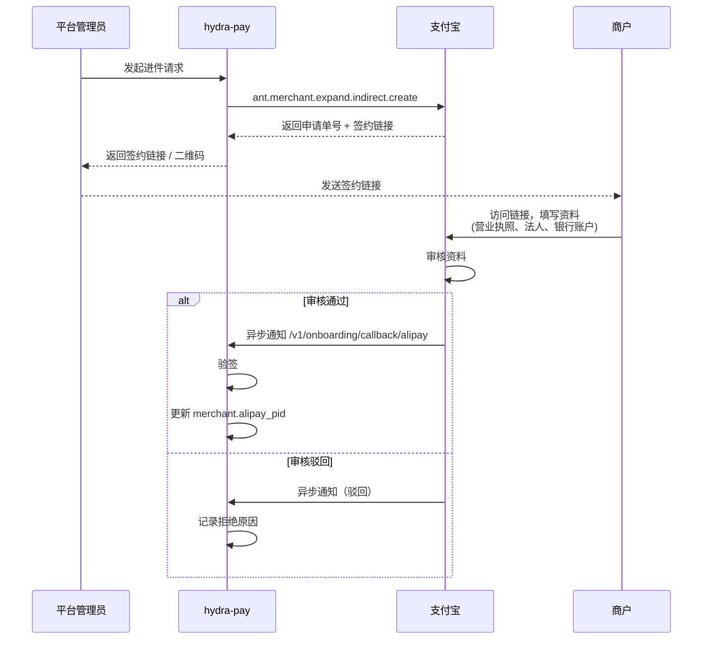
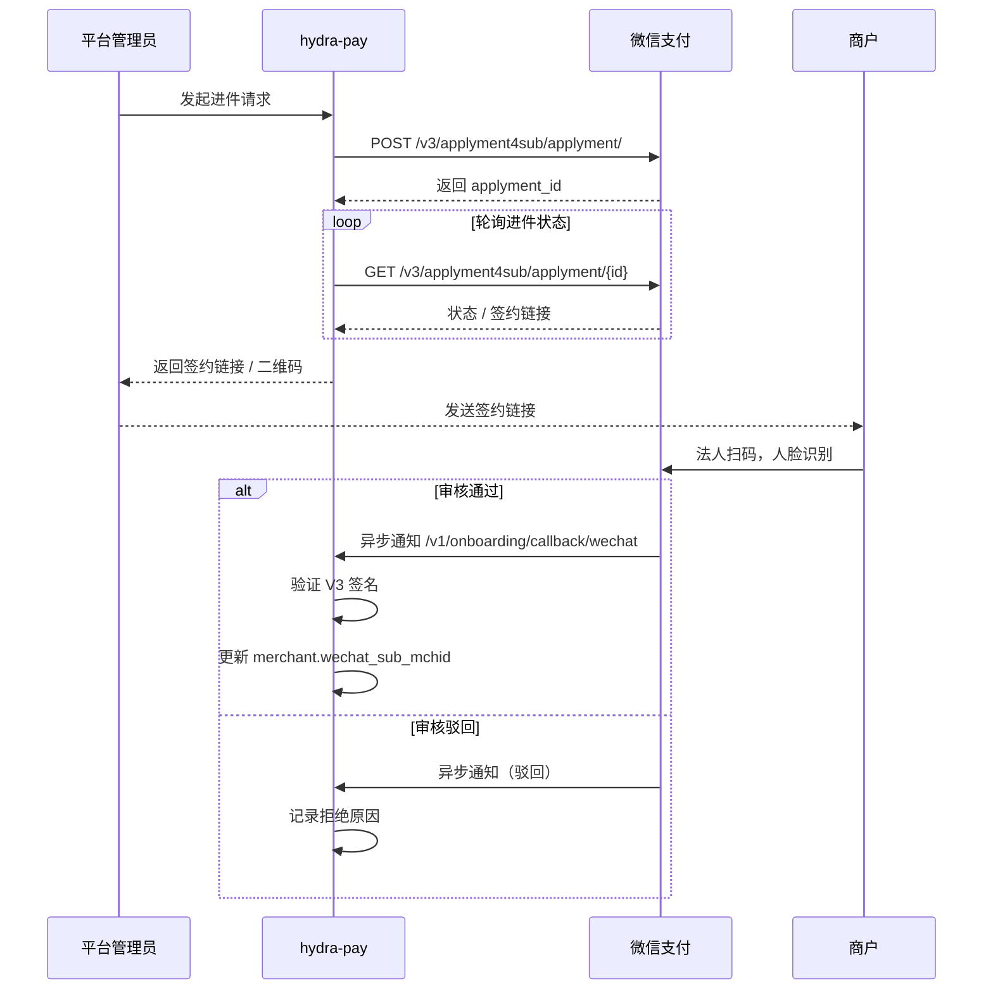

# 商户自助进件（Merchant Self-Service Onboarding）

## 背景

当前 hydra-pay 支持服务商模式的**支付**（通过 `SubMerchantID` 字段），但缺少商户进件流程。管理员需要手动从支付宝/微信服务商后台获取商户的 PID 和 sub_mchid，再填入 hydra-pay。

本方案实现平台生成进件链接，商户自行完成认证，审核结果异步回调自动更新商户渠道 ID。

## 架构概览

```
Admin 发起进件 → 调用渠道进件 API → 返回签约链接/二维码
                                            ↓
                                   商户扫码自助填写资料 + 人脸认证
                                            ↓
                      渠道异步回调 → 自动更新 Merchant 渠道 ID
```

## 数据模型

进件记录通过 `merchant_onboardings` 表管理，关联到 `merchants` 表。详细字段参见 [数据模型](/dev/architecture/data-model#merchant-onboardings-商户进件表)。

## 进件请求参数

```json
{
  "channel": "wechat",
  "merchant_name": "某某科技有限公司",
  "contact_name": "张三",
  "contact_phone": "13800138000",
  "contact_email": "zhangsan@example.com"
}
```

## 进件流程

### 支付宝



### 微信支付



## 进件状态

```
pending → submitted → auditing → approved / rejected
```

| 状态 | 说明 |
|------|------|
| pending | 已创建，等待提交 |
| submitted | 已提交至渠道 |
| auditing | 渠道审核中 |
| approved | 审核通过，渠道 ID 已自动写入 |
| rejected | 审核驳回，记录拒绝原因 |

## API 端点

### 管理后台（Admin Auth）

| 方法 | 路径 | 说明 |
|------|------|------|
| POST | `/api/admin/apps/:id/onboard` | 为 App 发起进件 |
| GET | `/api/admin/apps/:id/onboarding` | 查询进件状态（含自动轮询） |
| GET | `/api/admin/onboarding` | 进件列表（支持过滤和分页） |

### 渠道回调（公开）

| 方法 | 路径 | 说明 |
|------|------|------|
| POST | `/v1/onboarding/callback/:channel` | 渠道进件结果异步通知 |

## 配置（环境变量）

| 变量 | 说明 |
|------|------|
| `ALIPAY_ONBOARDING_NOTIFY_URL` | 支付宝进件结果回调地址 |
| `WECHAT_ONBOARDING_NOTIFY_URL` | 微信支付进件结果回调地址 |
