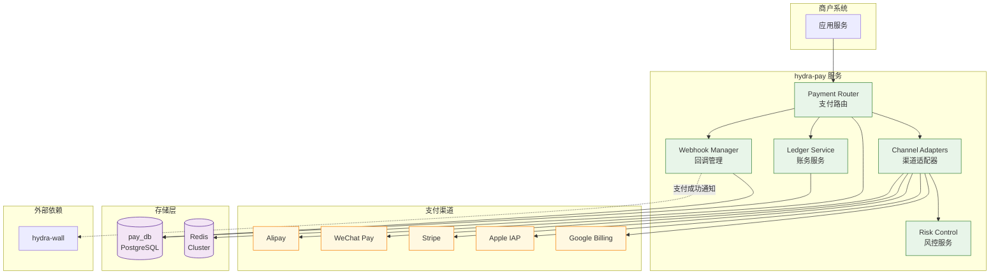
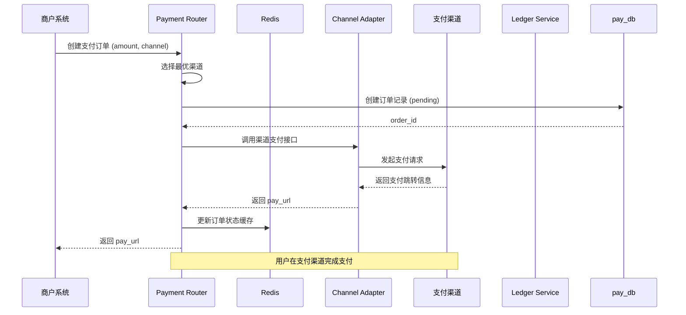
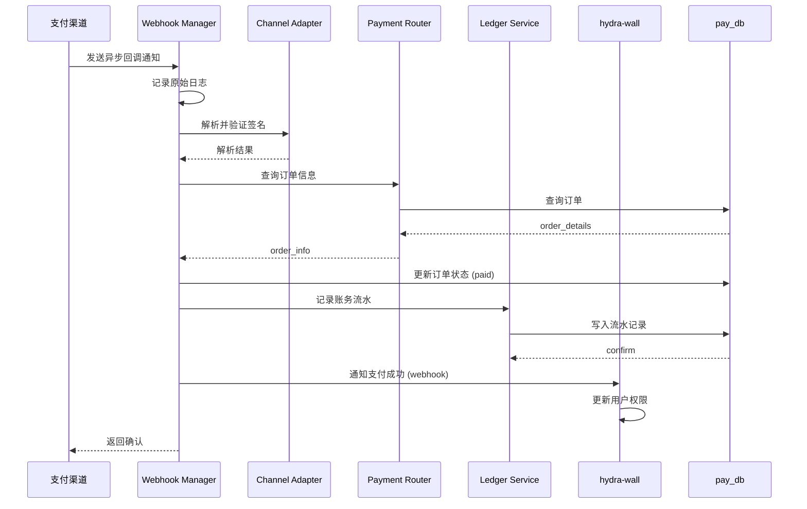
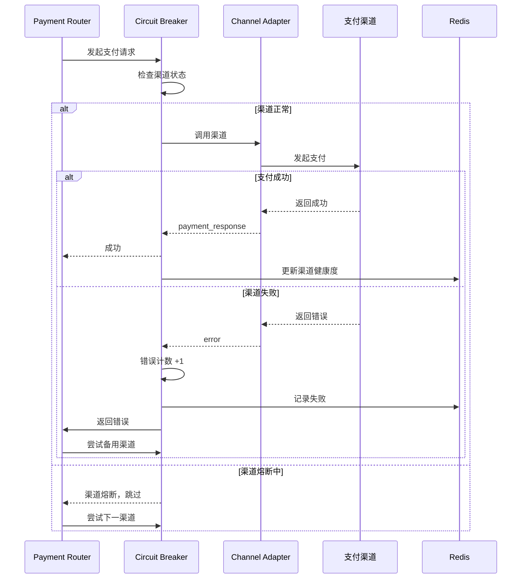

# 服务架构

Hydra-Pay 是统一的支付网关服务，负责聚合多个支付渠道，提供统一的支付接口和支付路由能力。

## 系统架构图

## 核心模块

### Payment Router

支付路由是系统的核心，负责将支付请求路由到合适的渠道。

- 接收来自商户的支付请求
- 根据渠道可用性、价格、成功率等因素选择最优渠道
- 支持渠道降级和故障转移

### Channel Adapters

渠道适配器是对接各个支付渠道的插件模块。

- 统一抽象接口，屏蔽各渠道差异
- 支持插件化扩展新渠道
- 包含 Alipay、WeChat Pay、Stripe、Apple IAP、Google Billing 等

### Ledger Service

账务服务，负责记账和资金流水管理。

- 记录每一笔交易流水
- 支持多币种结算
- 提供对账和清结算功能

### Webhook Manager

回调管理服务。

- 接收各渠道的异步回调
- 统一处理回调解析和签名验证
- 支持回调重试和死信队列

### Risk Control

风控服务。

- 交易风险识别
- 欺诈检测
- 限频限流

## 核心交互时序图

### 支付下单流程

### 支付回调处理流程

### 渠道熔断降级流程

## 存储架构

| 存储 | 用途 |
|------|------|
| PostgreSQL (pay_db) | 持久化存储：订单、流水、渠道配置 |
| Redis | 热点数据缓存、队列、分布式锁 |

## 性能目标

- P99 响应时间: < 200ms（不含渠道耗时）
- 可用性: 99.95%
- 支持 QPS: 5,000+
