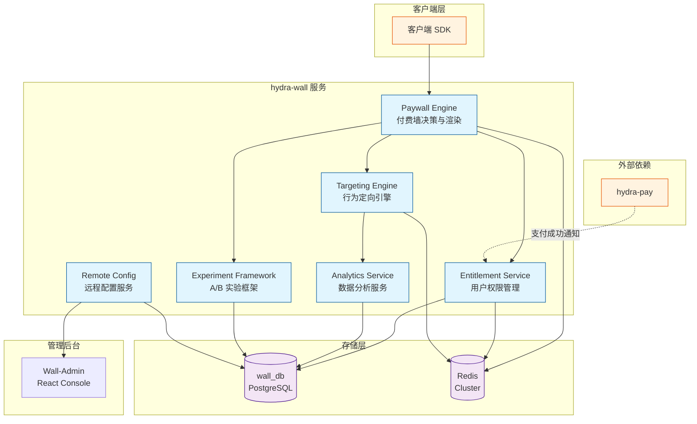
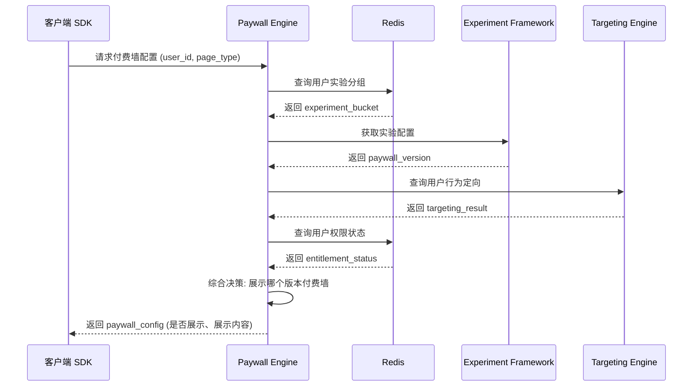
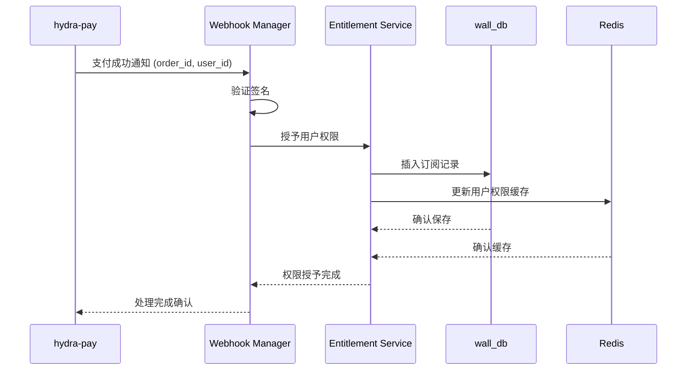
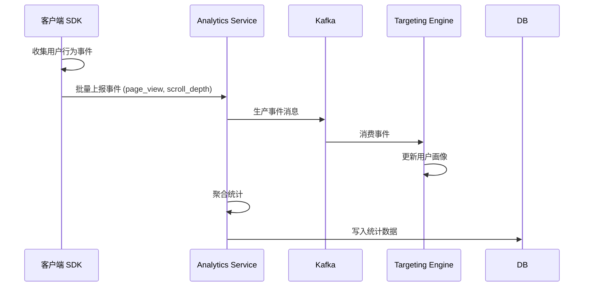

# 服务架构

Hydra-Wall 是独立的付费墙服务，负责付费墙展示、用户权限管理、行为定向和 A/B 实验。

## 系统架构图

## 核心模块

### Paywall Engine

负责付费墙的渲染和触发决策。

- 接收客户端 SDK 的付费墙请求
- 决策是否展示付费墙、展示哪个版本
- 支持本地渲染和远程渲染两种模式

### Entitlement Service

用户权限管理服务。

- 查询用户当前订阅状态
- 验证用户是否有权访问特定内容
- 监听支付服务 webhook 更新用户权限

### Targeting Engine

行为定向引擎。

- 收集和存储用户行为事件
- 根据用户行为特征决定付费墙展示策略
- 支持实时和批量两种定向计算模式

### Experiment Framework

A/B 实验框架。

- 管理实验配置和流量分配
- 保证实验分桶的随机性和一致性
- 收集实验相关的事件数据

### Remote Config

远程配置服务。

- 管理付费墙规则、灰度配置
- 支持热更新，无需发版
- 提供配置版本管理和回滚

### Analytics Service

数据上报服务。

- 接收并处理客户端和服务器端事件
- 输出实验数据和转化漏斗数据
- 与外部分析平台对接

## 核心交互时序图

### 付费墙展示流程

### 支付成功后的权限更新流程

### 行为事件上报流程

## 存储架构

| 存储 | 用途 |
|------|------|
| PostgreSQL (wall_db) | 持久化存储：用户权限、实验配置、行为数据 |
| Redis | 热点数据缓存、会话管理、配置缓存 |

## 部署模式

Hydra-Wall 支持独立部署，详见 [服务独立部署](../architecture/independence)

## 外部依赖

| 服务 | 用途 | 通信方式 |
|------|------|---------|
| hydra-pay | 支付成功后更新用户权限 | RPC (gRPC) |
| Redis | 缓存和会话 | TCP |
| wall_db | 持久化数据 | TCP |
| 客户端 SDK | 接收请求、返回响应 | HTTP REST |

## 性能目标

- P99 响应时间: < 50ms
- 可用性: 99.9%
- 支持 QPS: 10,000+

## 扩展性

各模块支持水平扩展：
- Paywall Engine: 无状态，可随意扩容
- Entitlement Service: 支持多实例，依赖 Redis 保证一致性
- Analytics Service: 支持消息队列削峰
