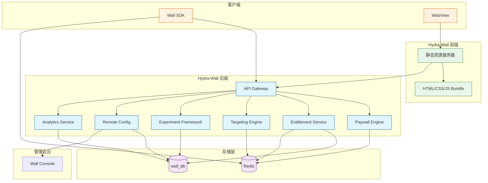
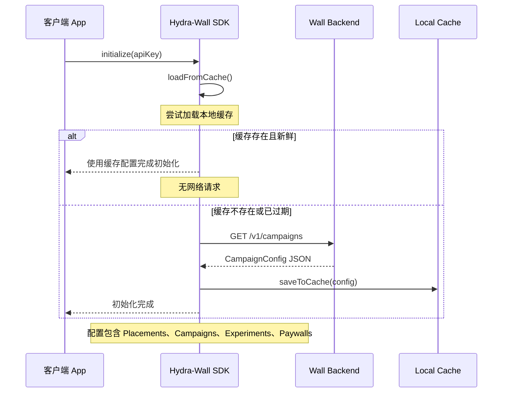
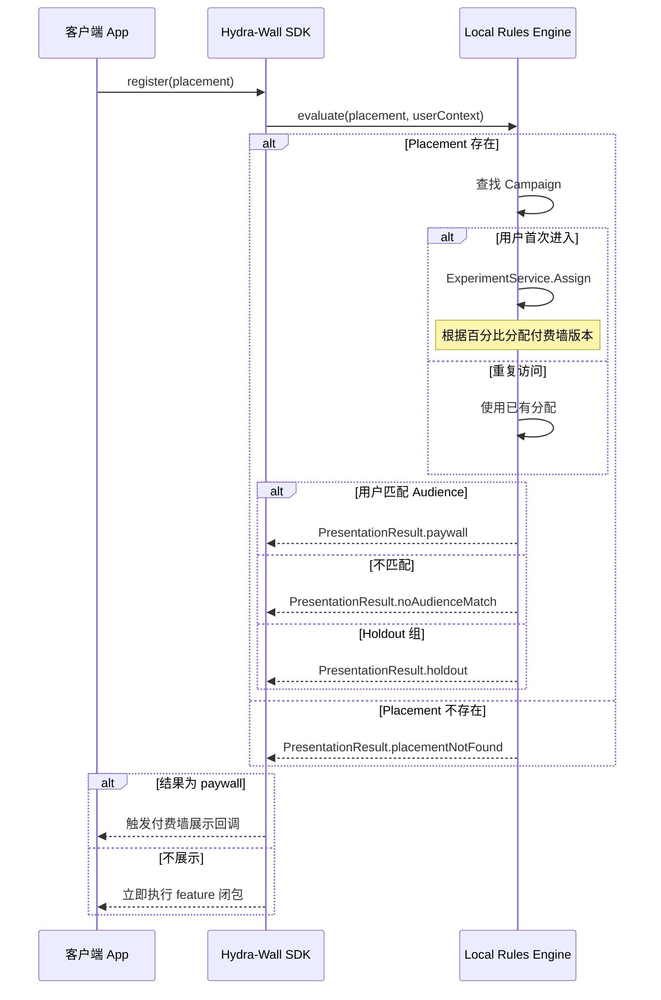
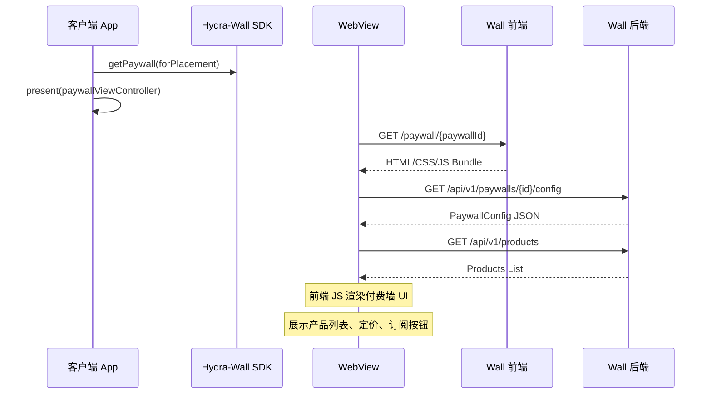
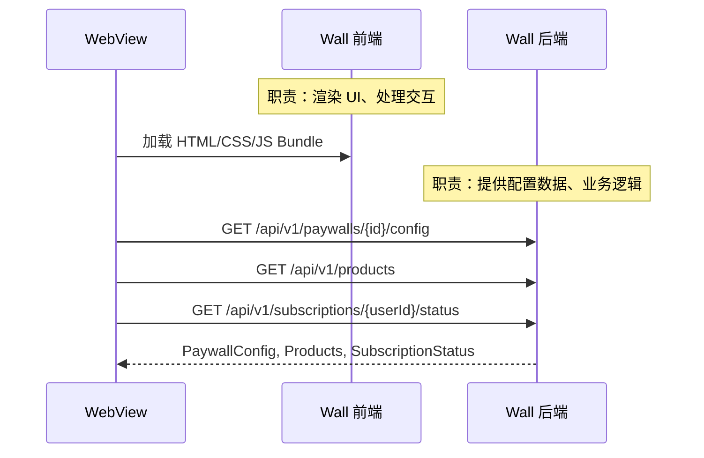
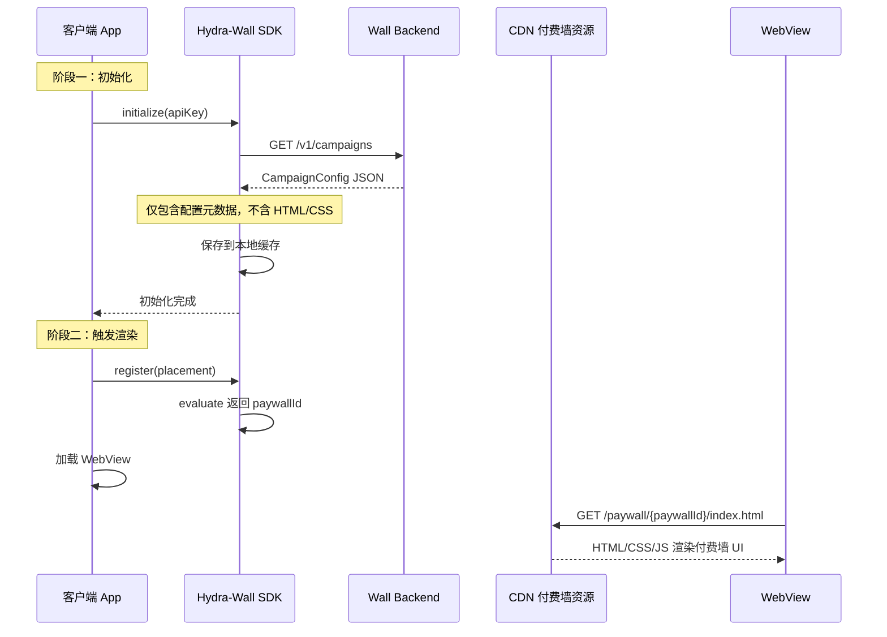
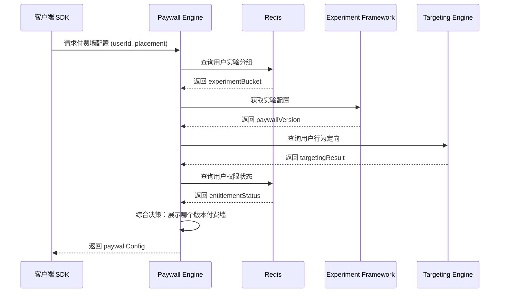
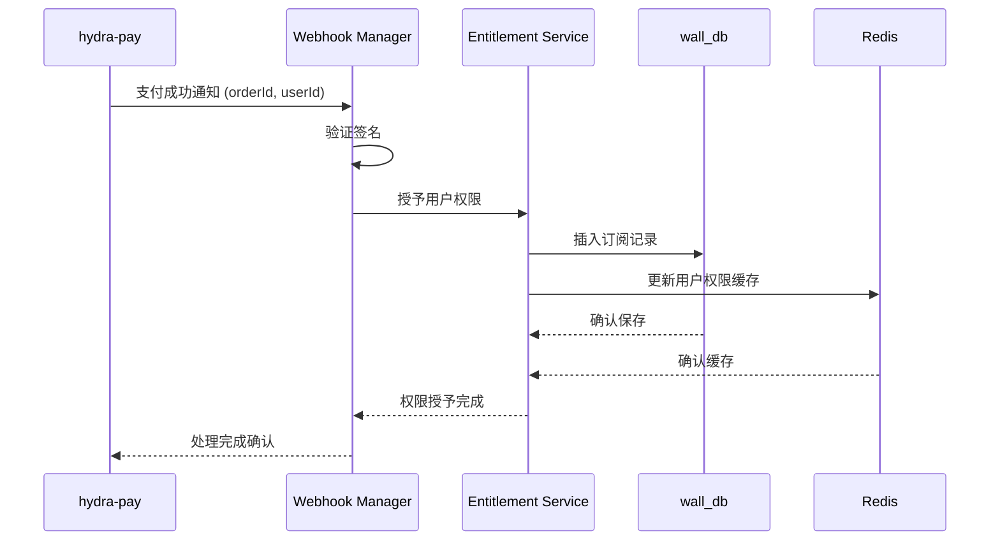

# Hydra-Wall 服务架构

Hydra-Wall 是自建的付费墙服务（类比同类服务），负责付费墙展示、用户权限管理、行为定向和 A/B 实验。

## 架构设计目标

与  架构一致，采用：
- **SDK 本地缓存配置** + **设备端规则评估**（零延迟、离线可用）
- **WebView 渲染付费墙**（跨平台一致、热更新）
- **前端与后端分离**（前端加载 Bundle，后端提供 API）

## 系统架构图

## 核心架构：SDK 本地评估 + WebView 渲染

本服务采用以下架构设计：

### 阶段一：SDK 初始化

### 阶段二：设备端规则评估

### 阶段三：WebView 渲染付费墙

## 核心模块

### Paywall Engine

付费墙决策与渲染服务。

| 职责 | 说明 |
|------|------|
| 规则匹配 | 根据 Placement、Audience、Experiment 决定展示哪个付费墙 |
| 配置提供 | 返回 PaywallConfig 给前端 |
| 模板渲染 | 支持多种付费墙模板 |

### Entitlement Service

用户权限管理服务。

| 职责 | 说明 |
|------|------|
| 权限查询 | 查询用户当前订阅状态 |
| 权限验证 | 验证用户是否有权访问特定内容 |
| 权限更新 | 监听支付成功通知，更新用户权限 |

### Targeting Engine

行为定向引擎。

| 职责 | 说明 |
|------|------|
| 行为收集 | 收集和存储用户行为事件 |
| 用户分群 | 根据行为特征进行用户分群 |
| 定向计算 | 支持实时和批量定向计算 |

### Experiment Framework

A/B 实验框架。

| 职责 | 说明 |
|------|------|
| 实验配置 | 管理实验配置和流量分配 |
| 分桶分配 | 保证实验分桶的随机性和一致性 |
| 数据收集 | 收集实验相关的事件数据 |

### Remote Config

远程配置服务。

| 职责 | 说明 |
|------|------|
| 规则管理 | 管理付费墙规则、灰度配置 |
| 热更新 | 支持配置热更新，无需发版 |
| 版本控制 | 提供配置版本管理和回滚 |

### Analytics Service

数据上报服务。

| 职责 | 说明 |
|------|------|
| 事件接收 | 接收并处理客户端和服务器端事件 |
| 漏斗分析 | 输出实验数据和转化漏斗数据 |
| 外部对接 | 与外部分析平台对接 |

## WebView 渲染架构

### 前端与后端分工

| 组件 | 职责 |
|------|------|
| **前端（静态资源）** | HTML/CSS/JS Bundle，提供 UI 渲染和用户交互 |
| **后端（API 服务）** | 提供付费墙配置、产品数据、用户订阅状态 |

### WebView 渲染优势

| 优势 | 说明 |
|------|------|
| **跨平台一致** | 同一 HTML/CSS 在 iOS/Android/Web 渲染完全一致 |
| **热更新** | 付费墙样式和逻辑可随时修改，无需 App 更新 |
| **向后兼容** | 浏览器内核保证旧内容持续可渲染 |
| **迭代速度** | 运营人员可通过后台修改付费墙配置 |

## 配置缓存策略

### 两个阶段的数据分离

### 初始化拉取的内容（轻量配置）

| 数据 | 大小 | 说明 |
|------|------|------|
| Campaigns | <10KB | 活动配置 |
| Paywalls | <20KB | 付费墙 ID 和触发条件 |
| Experiments | <10KB | 实验分组配置 |
| Placements | <5KB | 触发点配置 |
| **总计** | **<50KB** | 轻量 JSON |

### 渲染时才加载的内容（重量资源）

| 资源 | 大小 | 说明 |
|------|------|------|
| HTML 模板 | 50-200KB | 付费墙布局结构 |
| CSS 样式 | 30-100KB | 主题、颜色、字体 |
| JS 逻辑 | 20-80KB | 交互逻辑、产品展示 |
| **总计** | **100-400KB** | 首次渲染需要下载 |

### 离线行为

| 场景 | 配置可用 | 付费墙可渲染 |
|------|---------|-------------|
| 缓存新鲜 | 是 | 是（已缓存） |
| 缓存过期，无网络 | 是（用过期配置） | 否（新付费墙无法加载） |
| 首次安装，无网络 | 否 | 否 |

## 核心交互时序

### 付费墙展示流程

### 支付成功后的权限更新流程

## 存储架构

| 存储 | 用途 |
|------|------|
| PostgreSQL (wall_db) | 持久化存储：用户权限、实验配置、行为数据 |
| Redis | 热点数据缓存、会话管理、配置缓存 |

## 部署模式

Hydra-Wall 支持独立部署，详见 [服务独立部署](../architecture/independence)

## 外部依赖

| 服务 | 用途 | 通信方式 |
|------|------|---------|
| hydra-pay | 支付成功后更新用户权限 | RPC (gRPC) |
| Redis | 缓存和会话 | TCP |
| wall_db | 持久化数据 | TCP |
| CDN | 前端静态资源 | HTTPS |

## 性能目标

- P99 响应时间: < 50ms（设备端评估）
- 首次渲染延迟: 100-400KB（CDN 加速）
- 可用性: 99.9%
- 支持 QPS: 10,000+

## 扩展性

各模块支持水平扩展：
- Paywall Engine: 无状态，可随意扩容
- Entitlement Service: 支持多实例，依赖 Redis 保证一致性
- Analytics Service: 支持消息队列削峰
